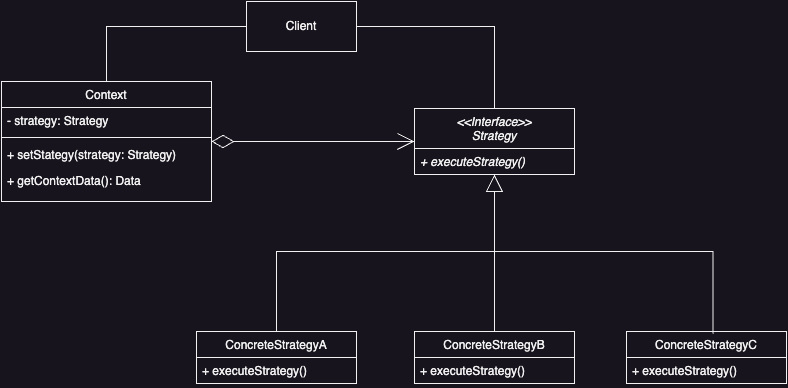

# Strategy Pattern

## Introduction
Define a family of algorithms, encapsulate each one, and make them interchangeable. Strategy lets the algorithms vary independently, from clients that use it.

### Problem

How to provide the client an ability to select and execute one of the available algorithms.

### Solution

Define an abstract class to provide a common interface to make the algorithms interchangeable. Let each subclass implement an available algorithm. The client can select a subclass object and delegate the work to that object.

## Applicability

* ***Related Classes Differ Only in Behavior***
  * Use strategies to configure a class with one of many behaviors

* ***Different Algorithm Variants Needed***
  * Implement different versions of an algorithm, each with different trade-offs, using a class hierarchy of algorithms

* ***Hide Complex Data from Clients***
  * Use strategies to keep clients from needing to understand complex, algorithm-specific data structures

* ***Simplify Conditional Statements***
  * Move related conditional branches into their own strategy class to reduce complexity in your main class

## Benefits

* **Families of Related Algorithms**
  * Define a family of algorithms or behaviors that can be reused through a hierarchy of Strategy classes.
  * Use inheritance to factor out common functionality.

* **Alternative to Subclassing**
    * Encapsulating algorithms in Strategy classes to make them easier to switch, understand, and extend.
    * Avoid hard-wiring behavior into the *Context* class.

* **Eliminates Conditional Statements**
  * Replace conditional statements with separate Strategy classes for selecting behavior.
  * Reduce complexity in code by encapsulating different behaviors in distinct Strategy classes.

* **Choice of Implementations**
  * Provide different implementations of the same behavior, allowing clients to choose based on time and space trade-offs.

## Liabilities

* **Client Awareness**
    * Clients must understand the differences between Strategies to select the appropriate one.
    * Use this pattern only when behavior is relevant to clients.

* **Communication Overhead**
    * The Strategy interface may require parameters that some *ConcreteStrategies* don't use, causing potential inefficiency.
    * Tighter coupling may be needed if unused parameters are an issue.
    
## UML

### Class Diagram



## Code Example

### Scenario

Imagine you are developing a data processing application that needs to sort data in different ways, depending on the specific requirements of the task at hand. You might want to sort the data using different algorithms like QuickSort, MergeSort, or BubbleSort. In this case, the Strategy pattern is more suitable than lets say Template Method pattern because it allows you to dynamically change the sorting at runtime.

```java
// Strategy Interface
public interface SortStrategy {
    void sort(int [] array);
}
```

```java
// Concrete Strategies
public class QuickSortStrategy implements SortStrategy {
    @Override
    public void sort(int[] array) {
        // Quick Sort Implementation ...
    }
}

public class MergeSortStrategy implements SortStrategy {
  @Override
  public void sort(int[] array) {
    // Merge Sort Implementation ...
  }
}

public class BubbleSortStrategy implements SortStrategy {
  @Override
  public void sort(int[] array) {
    // Bubble Sort Implementation ...
  }
}
```

```java
// Context
public class DataProcessor {
    private SortStrategy strategy;
    
    public void setStrategy(SortStrategy strategy) {
        this.strategy = strategy;
    }
    
    public void processData(int[] data) {
        this.strategy.sort(data);
    }
}
```

```java
// Client
public class StrategyPatternDemo {
    public static void main(String[] args) {
        DataProcessor dataProcessor = new DataProcessor();
        int[] data = {5, 2, 9, 1, 5, 6};
        
        // Using Quick Sort
      dataProcessor.setStrategy(new QuickSortStrategy());
      dataProcessor.processData(data);
      
      // Using Merge Sort
      dataProcessor.setStrategy(new MergeSortStrategy());
      dataProcessor.processData(data);
      
      // Using Bubble Sort
      dataProcessor.setStrategy(new BubbleSortStrategy());
      dataProcessor.processData(data);
    }
}
```

## Implementation Notes

### Defining Strategy and Context Interfaces

When defining the Strategy and Context interfaces, ensure efficient data access between them. One method is to have the Context pass required data as parameters to the Strategy's operations, keeping them decoupled but possibly passing unnecessary data. Alternatively, the Context can pass itself as an argument, allowing the Strategy to request only the data it needs, or the Strategy can store a reference to its Context. This closer coupling requires a more detailed Context interface. Choose the best approach based on the specific needs and data requirements of the algorithm.

### Making Strategy Objects Optional 
To simplify the Context class, it can be designed to check for a Strategy object before using it. If a Strategy is present, the Context uses it; if not, the Context performs a default behavior. This way, clients only need to interact with Strategy objects if they want to override the default behavior, reducing the complexity for those who are satisfied with the default.

### Strategies as Template Parameters
In C++, you can use templates to configure a class with a Strategy, provided the Strategy is selected at compile time and doesn't need to change at runtime. This approach eliminates the need for an abstract Strategy class and allows static binding of a Strategy to its Context, enhancing efficiency.

```java
// java code equivalent to C++ templates

interface Strategy {
    int execute(int a, int b);
}

class AdditionStrategy implements Strategy {
    @Override
    int execute(int a, int b) {
        return a + b;
    }
}


class SubstractionStrategy implements Strategy {
    @Override
    int execute(int a, int b) {
        return a - b;
    }
}

class Context {
    private Strategy strategy;
    
    Context(Strategy strategy) {
        this.strategy = strategy;
    }
    
    void setStrategy(Strategy strategy) {
        this.strategy = strategy;
    }
    
    int executeStrategy(int a, int b) {
        this.strategy.execute(a, b);
    }
}

class StrategyDemoClient {
    public static void main(String[] args) {
        Context context = new Context(new AdditionStrategy());
        System.out.println("10 + 5 = " + context.executeStrategy(10, 5));
        
        context.setStrategy(new SubstractionStrategy());
        System.out.println("10 - 5 = " + context.executeStrategy(10, 5));
    }
}
```
## Related Patterns

* **Flyweight**
  * Strategy objects often make good flyweights

* **Template Method**
  * Template Method is based on inheritance: it lets you alter parts of an algorithm by extending those parts in subclasses
  * Strategy is based on composition: you can alter parts of the object's behavior by supplying it with different strategies that correspond to that behavior
  * Template Method works at the class level, so its static, and Strategy works on the object level, letting you switch behaviors at runtime