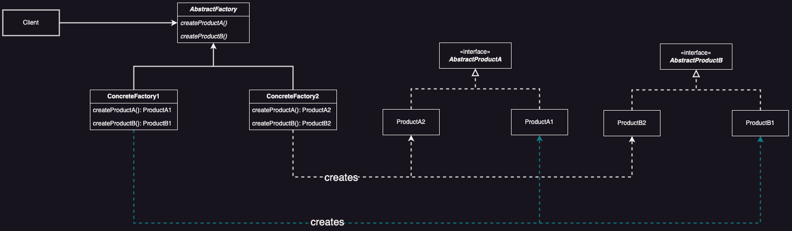

# Abstract Factory

## Introduction

**Abstract Factory** provides an interface for creating families of related or dependent objects without specifying their concrete class.

### Problem

How to create objects of different families and hide from the client which family of objects is created?

### Solution

Define an object creation interface and let each subclass create one family objects.

## Applicability

* **Decoupling of *Product* creation**
  * The system can work without needing to know exactly how each product is made or organized

* **Configuration with *Product* families**
  * The system can be configured to select from various groups of related products, each intended to seamlessly collaborate.

* **Enforcing *Product* Compatibility**
  * The system can ensure related products are used together smoothly, preventing any mix-ups that might cause problems.

* **Abstraction of *Product* Implementations**
  * Shows just the product interfaces, keeping users from dealing with the nitty-gritty of how they're made

## Benefits

&nbsp;&nbsp;&nbsp;&nbsp;***Isolates concrete classes***, controlling object creation by encapsulating it within factories. Clients interact with instances through abstract interfaces, keeping product class details hidden in factory implementations.

> [!NOTE]
> Provides a uniform interface for creating different brand of products

&nbsp;&nbsp;&nbsp;&nbsp;***Encourages product uniformity***. Abstract Factory ensures that product objects within a family are harmoniously designed to collaborate. Maintaining consistency is simplified as the pattern facilitates the strict usage of objects from a single family at any given time.

> [!NOTE]
> Easy to add new features that can use the *Abstract Factory* interface

&nbsp;&nbsp;&nbsp;&nbsp;***Streamlines product family interchangeability*** by limiting the visibility of the concrete factory class within the application. This enables seamless swapping of factory instances, facilitating effortless transitions between different product configurations. As the abstract factory generates entire product families, switching factories triggers simultaneous adjustments across all product types.

> [!NOTE]
> A concrete factory can ensure the integrity of the products it creates.
> The client is unaware of the brands or product of families as well as the concrete families. The client can work with different product families transparently.

## Liabilities

&nbsp;&nbsp;&nbsp;&nbsp;***Supporting new kinds of products is difficult***. Extending abstract factories to produce new kinds of products isn't easy. That's because the *Abstract Factory* interface fixes the set of products that can be created. Supporting new kinds of products requires extending the factory interface, which involves changing the *Abstract Factory* class and all of its subclasses. The code may be more complicated than it should be, since a lot of new interfaces and classes are introduced along with the pattern.

> [!CAUTION]
> Difficult to add products or factories that require change to the *Abstract Factory* interface

## UML

<div style="text-align:center">
  
</div>

## Code Example

```java
// Abstract Product A: Beverage
interface Beverage {
    void serve();
}

// Concrete Product A1: Coffee
class Coffee implements Beverage {
    @Override
    public void serve() {
        System.out.println("Here's your coffee!");
    }
}

// Concrete Product A2: Tea
class Tea implements Beverage {
    @Override
    public void serve() {
        System.out.println("Here's your tea!");
    }
}
```

```java
// Abstract Product B: Topping
interface Topping {
    void add();
}

// Concrete Product B1: Milk
class Milk implements Topping {
    @Override
    public void add() {
        System.out.println("Adding Milk...");
    }
}

// Concrete Product B2: Sugar
class Sugar implements Topping { 
    @Override
    public void add() {
        System.out.println("Adding Sugar...");
    }
}
```

```java
// Abstract Factory: BeverageFactory
abstract class BeverageFactory { 
    abstract public Beverage createBeverage();
    abstract public Topping createTopping();
    void coreBusinessLogic() {
        System.out.println("Some core business logic that does with creation");
    }
}

// Concrete Factory A1 and B1: Coffee Factory
class CoffeeFactory extends BeverageFactory { 
    @Override 
    public Beverage createBeverage() {
        return new Coffee();
    }
    
    @Override 
    public Topping createTopping() {
        return new Milk();
    }
}

// Concrete Factory A2 and B2: Tea Factory
class TeaFactory extends BeverageFactory { 
    @Override
    public Beverage createBeverage() {
        return new Tea();
    }
    
    @Override
    public Topping createTopping() {
        return new Sugar();
    }
}
```

```java
// Client: Customer
class Customer { 
    private final Beverage beverage;
    private final Topping topping;
    
    public Customer(BeverageFactory beverageFactory) {
        this.beverage = beverageFactory.createBeverage();
        this.topping = beverageFactory.createTopping();
    }

    public void enjoy() {
        beverage.serve();
        topping.add();
    }
}
```

```java
public class Main {
    public static void main(String[] args) {
        // Create a coffee order
        BeverageFactory coffeeFactory = new CoffeeFactory();
        Customer coffeeLover = new Customer(coffeeFactory);
        coffeeLover.enjoy();
        
        // Create a tea order
        BeverageFactory teaFactory = new TeaFactory();
        Customer teaLover = new Customer(teaFactory);
        teaLover.enjoy();
    }
}
```

## Implementation Notes

### Factories as Singletons

An application typically only needs one instance of a Concrete Factory per product family!

#### Code Example With CoffeeFactory

```java
// Concrete Factory A1 and B1: Coffee Factory
class CoffeeFactory extends BeverageFactory {
    private static CoffeeFactory instance;
    
    private CoffeeFactory() {}
    
    public static CoffeeFactory getInstance() {
        if (instance == null) {
            instance = new CoffeeFactory();
        }
        return instance;
    }
    
    @Override
    public Beverage createBeverage() {
        return new Coffee();
    }

    @Override
    public Topping createTopping() {
        return new Milk();
    }
}
```

### Creating the Products

&nbsp;&nbsp;&nbsp;&nbsp;*AbstractFactory* only declares an interface for creating products. It's up to *ConcreteProduct* subclasses to actually create them. The most common way to do this is to define a factory method for each product. A concrete factory will specify its products by overridding the factory method for each. This method was implemented in the [coding example](#code-example).

> [!CAUTION]
> This is a simple implementation, but requires a concrete factoy subclass for each product family (even if the products differ slightly)

&nbsp;&nbsp;&nbsp;&nbsp;Using the Prototype Pattern on the *ConcreteFactory* when having many product fmailies will reduce the number of *ConcreteFactory* subclasses.

> [!NOTE]
> The Prototype-based approach eliminates the need for a new concrete factory subclass for each product family

#### Coding Example Using Prototype

```java
// Prototype Interface: Beverage Prototype
interface BeveragePrototype extends Cloneable {
    BeveragePrototype clone();
}

// Abstract Product A: Beverage
interface Beverage implements BeveragePrototype{ 
    void serve();
}

// Concrete Product A1: Coffee
class Coffee implements Beverage {
    @Override
    public void serve() {
        System.out.println("Here's your coffee!");
    }
    
    @Override
    public BeveragePrototype clone() {
        return new Coffee();
    }
}

// Concrete Product A2: Tea
class Tea implements Beverage {
    @Override
    public void serve() {
        System.out.println("Here's your tea!");
    }
  
    @Override
    public BeveragePrototype clone() {
        return new Tea();
    }
}
```

```java
// Prototype Interface: Topping Prototype
interface ToppingPrototype extends Cloneable { 
    ToppingPrototype clone();
}

// Abstract Product B: Topping
interface Topping implements ToppingPrototype { 
    void add();
}

// Concrete Product B1: Milk
class Milk implements Topping {
    @Override
    public void add() {
        System.out.println("Adding Milk...");
    }
  
    @Override
    public ToppingPrototype clone() {
        return new Milk();
    }
}

// Concrete Product B2: Sugar
class Sugar implements Topping {
    @Override
    public void add() {
        System.out.println("Adding Sugar...");
    }
    
    @Override
    public ToppingPrototype clone() {
        return new Sugar();
    }
}
```

```java
// Abstract Factory: BeverageFactory
interface BeverageFactory { 
    Beverage createBeverage();
    Topping createTopping();
}

// Concrete Factory: PrototypeFactory
class PrototypeFactory implements BeverageFactory {
    private BeveragePrototype beveragePrototype;
    private ToppingPrototype toppingPrototype;
    
    PrototypeFactory(BeveragePrototype bp, ToppingPrototype tp) {
        this.beveragePrototype = bp;
        this.toppingPrototype = tp;
    }
    
    @Override
    public Beverage createBeverage() {
        return (Beverage) beveragePrototype.clone();
    }
    
    @Overrride
    public Topping createTopping() {
        return (Topping) toppingPrototype.clone();
    }
}
```

```java
public class Main { 
    public static void main(String[] args) {
        BeveragePrototype coffeePrototype = new Coffee();
        BeveragePrototype teaPrototype = new Tea();
        ToppingPrototype milkPrototype = new Milk();
        ToppingPrototype sugarPrototype = new Sugar();

        BeverageFactory coffeeMilkFactory = new PrototypeFactory(coffeePrototype, milkPrototype);
        BeverageFactory teaSugarFactory = new PrototypeFactory(teaPrototype, sugarPrototype);
      
        Customer coffeeLover = new Customer(coffeeMilkFactory);
        Customer teaLover = new Customer(teaSugarFactory);
      
        coffeeLover.enjoy();
        teaLover.enjoy();
  }
}
```

## Related Patterns

* *Abstract Factory* often uses the *Factory Method*.
  * The *Abstract Factory* is an abstract class with factory methods; the concrete factories implement the factory methods to the vary the brand of products created.

* *Abstract Factory* can use Prototype if the products of different brands **share the same behaviour**.
  * For example, car components of different brands share the same behaviour. Therefore, Prototype can be used to eliminate the product hierarchy.

* Builder can be used to produce complex products for *Abstract Factory*.
  * *Abstract Factory* can produce the products used by *Builder*.
