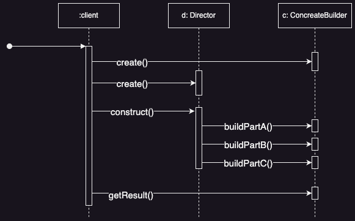
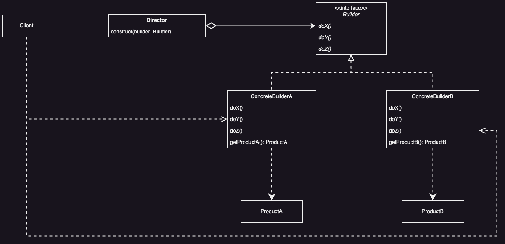

# Builder Pattern

## Introduction
**Builder Pattern** separates the construction of a complex object from its representation so that the same construction process can create different representations.

### Problem
How to vary the construction processes and the individual construction steps, so they can be combined in flexible ways to construct different products.

### Solution
Decouple the construction processes and the construction steps into two separate hierarchies, so they can be combined in more flexible ways.

## Applicability

* ***Separation of Construction and Assembly***
  * The process of creating a complex object should be separate from the details of its parts and how they fit together.

* ***Flexible Construction***
  * The method of building an object should support different versions and configurations of that object.

## Benefits

* ***Flexible Product Representation***
  * You can change how a product is built without altering its parts.
  * The Builder provides a way to hide the product's details and assembly process.
  * To change the product's internal structure, just create a new Builder.

* ***Isolated Construction and Representation***
  * The construction logic is separate from the product's structure.
  * Clients don't need to know about the product's internal classes.
  * Each `ConcreteBuilder` has all the code to build a specific product.
  * The same set of parts can create different products through different Directors.

* ***Fine Control Over Construction***
  * The Builder pattern constructs products *step-by-step*, not all at once.
  * The `Director` controls the construction process and retrieves the product only when it's complete.
  * This *step-by-step* process allows precise control over how the product is built.

## Liabilities

* ***Increased Complexity***
  * Implementing the Builder pattern can add complexity to the codebase due to the additional classes and interfaces involved.

## UML

### Sequence Diagram

<div style="text-align:center">
  
</div>

### Class Diagram

<div style="text-align:center">
  
</div>

## Code Example

```java
// Product A: Pizza
class Pizza {
    private String size;
    private String crustType;
    private List<String> toppings;
    
    public Pizza(String size, String crustType, List<String> toppings) {
        this.size = size;
        this.crustType = crustType;
        this.toppings = toppings;
    }
    
    @Override
    public String toString() {
        return "Pizza { " +
                "size= " + size + ", " +
                "crustType= " + crustType + ", " +
                "toppings= " + toppings + "}\n";
    }
}

// Product B: Sandwich
class Sandwich {
    private String size;
    private String breadType;
    private List<String> toppings;
    
    public Sandwich(String size, String breadType, List<String> toppings) {
        this.size = size;
        this.breadType = breadType;
        this.toppings = toppings;
    }
    
    @Override
    public String toString() {
        return "Sandwich { "+
                "size = " + size + ", " +
                "breadType = " + breadType + ", " +
                "toppings = " + toppings + "}\n";
    }
}
```

```java
// Builder Interface: Builder
interface Builder {
    Builder setSize(String size);

    Builder setType(String type);

    Builder addTopping(String topping);
}

// Concrete Builder A: PizzaBuilder
class PizzaBuilder implements Builder {
    private String size;
    private String crustType;
    private List<String> toppings;

    public PizzaBuilder() {
        this.toppings = new ArrayList<>();
    }

    @Override
    public Builder setSize(String size) {
        this.size = size;
        return this;
    }

    @Override
    public Builder setType(String crustType) {
        this.crustType = crustType;
        return this;
    }

    @Override
    public Builder addTopping(String topping) {
        this.toppings.add(topping);
        return this;
    }

    public Pizza build() {
        Pizza pizza = new Pizza(this.size, this.crustType, this.toppings);
        this.toppings = new ArrayList<>();
        return pizza;
    }
}

// Concrete Builder B: Sandwich Builder
class SandwichBuilder implements Builder {
    private String size;
    private String breadType;
    private List<String> toppings;

    public SandwichBuilder() {
        this.toppings = new ArrayList<>();
    }

    @Override
    public Builder setSize(String size) {
        this.size = size;
        return this;
    }

    @Override
    public Builder setType(String breadType) {
        this.breadType = breadType;
        return this;
    }

    @Override
    public Builder addTopping(String topping) {
        this.toppings.add(topping);
        return this;
    }
    
    public Sandwich build() {
        Sandwich sandwich = new Sandwich(this.size, this.breadType, this.toppings);
        this.toppings = new ArrayList<>();
        return sandwich;
    }
}
```

```java
// Director: Director
class Director {
    public void buildHawaiianPizza(Builder builder) {
        builder.setSize("Large")
                .setType("Thin")
                .addTopping("Ham")
                .addTopping("Pineapple");
    }

    public void buildItalianPizza(Builder builder) {
        builder.setSize("Large")
                .setType("Thick")
                .addTopping("Sausage");
    }

    public void buildVeggieSandwich(Builder builder) {
        builder.setSize("Large")
                .setType("Gluten Free")
                .addTopping("Avocado")
                .addTopping("Black Beans");
    }
}

public class Main {
    public static void main(String[] args) {
        Director director = new Director();
        
        PizzaBuilder pizzaBuilder = new PizzaBuilder();
        SandwichBuilder sandwichBuilder = new SandwichBuilder();
        
        director.buildHawaiianPizza(pizzaBuilder);
        director.buildVeggieSandwhich(sandwichBuilder);
        
        System.out.println(pizzaBuilder.build());
        System.out.println(sandwichBuilder.build());
        
        director.buildItalianPizza(pizzaBuilder);
        System.out.println(pizzaBuilder.build());
    }
}
```

## Implementation Notes

### No Abstract Classes for Products

&nbsp;&nbsp;&nbsp;&nbsp;In the common case, the products produced by the concrete builders differ so greatly in their representation that there is little to gain from giving different products a common parent class.

### Assembly and Construction Interface

&nbsp;&nbsp;&nbsp;&nbsp;Builders use a step-by-step approach to create their products. So, the Builder class interface needs to be flexible enough to work with different kinds of builders. One important consideration is how the construction and assembly process should work. One way is to just add each new part to the product as it's built. However, sometimes you might need to access parts of the product that were built earlier, especially in cases like building tree structures. In those situations, the builder might return child nodes to the director, which then sends them back to the builder to build the parent nodes.

```java
// Product: Represents a node in a tree structure 
class TreeNode {
    private String data;
    private List<TreeNode> children;
    
    public TreeNode(String data) {
        this.data = data;
        this.children = new ArrayList<>();
    }
    
    public void addChild(TreeNode child) {
        children.add(child);
    }
  
    @Override
    public String toString() {
        StringBuilder sb = new StringBuilder();
        sb.append(data);
        if (!children.isEmpty()) {
            sb.append(" [");
            for (TreeNode child : children) {
                sb.append(child.toString());
                sb.append(", ");
            }
            sb.delete(sb.length() - 2, sb.length());
            sb.append("]");
        }
        return sb.toString();
    }
}

// Builder Interface
interface TreeBuilder {
    TreeNode buildNode(String data);
}

// Concrete Builder: TreeBuilder
class TreeNodeBuilder implements TreeBuilder {
    @Override
    public TreeNode buildNode(String data) {
        return new TreeNode(data);
    }
}

// Director: Constructs the tree structure
class TreeDirector {
    private TreeBuiler builder;
    
    public TreeDirector(TreeBuilder treeBuilder) {
        this.builder = treeBuilder;
    }
    
    public TreeNode constructTree() {
        TreeNode root = builder.buildNode("Root");
        TreeNode child1 = builder.buildNode("Child 1");
        TreeNode child2 = builder.buildNode("Child 2");
        
        root.addChild(child1);
        root.addChild(child2);
        
        TreeNode grandchild1 = builder.buildNode("Grandchild 1");
        TreeNode grandchild2 = builder.buildNode("Grandchild 2");
        
        child1.addChild(grandchild1);
        child1.addChild(grandchild2);
        return root;
    }
}
```

### Empty Methods as Default In BUILDER Interface 

```java
interface Builder {
    default void buildPart1() {}    // Default empty method
    default void buildPart2() {}    // Default empty method
}

class ConcreteBuilder implements Builder {
    @Override
    public void buildPart1() {
        System.out.println("Overriding if needed, building part 1...");
    }
    
    // buildPart2 method is not overwritten, so it uses the default empty implementation
}

class Main {
    public static void main(String[] args) {
        Builder builder = new ConcreteBuilder();
        builder.buildPart1();
        builder.buildPart2();   // This uses the default empty implementation
  }
}
```

## Related Patterns

* **Abstract Factory**
  * Builder can build complex objects for Abstract Factory.
  * Abstract Factory can provide products for Builder.
  * Abstract Factory and Builder both create complex objects. The key difference is that Builder constructs the object step by step and returns it at the end, while Abstract Factory focuses on families of products and returns the product immediately.

* **Composite**
  * Builder can be used to create the complex Composite trees because you can program its construction steps to work recursively.

* Many designs start by using *Factory Method* (less complicated and more customizable via subclasses) and evolve toward *Abstract Factory*, *Prototype*, or *Builder* (more flexible but more complicated). 
