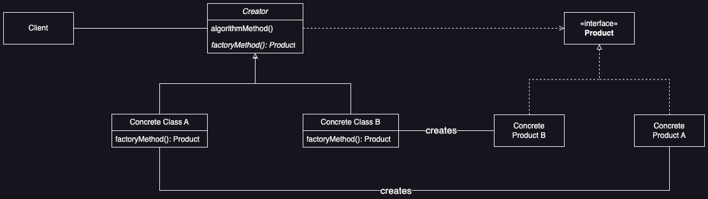

# Factory Method

## Introduction

**Factory Method** defines an interface for creating an object, but let subclasses decide which class to instantiate. **Factory Method** lets a class defer instantiation to subclasses. 

### Problem

How does one vary the type of objects used by an algorithm?

### Solution

Define an abstract class with a skeleton of the algorithm in which the type of objects that vary are returned by calls to an abstract method called a *factory method*, which is implemented by the subclasses to return different types of objects.

## Applicability

* ***Uncertain Object Types***
  * When a class doesn't know in advance which exact class it will need to instantiate.

* ***Subclass Decision-Making***
  * When a class wants its subclasses to determine which objects to create.

* ***Delegating Creation***
  * When a class hands off the responsibility of creating objects to helper subclasses, and you want to keep this decision-making localized.

## Benefits

* ***Flexibility in Object Creation***
  * Creating objects with a factory method is more flexible than direct instantiation.
  * Subclasses can easily extend and customize the object creation process.

* ***Utility for Clients***
  * Factory methods are primarily used by `Creators`, but clients can also benefit from them.
  * Particularly useful in parallel class hierarchies, where a class delegates some responsibilities to another class.

## Liabilities

* ***Subclassing Requirement***
  * Clients might need to subclass the `Creator` just to create specific `ConcreteProduct` objects.
  * This adds complexity if subclassing `Creator` isn't necessary for other reasons, introducing another point of evolution.

# UML

<div style="text-align:center">
  
</div>

# Code Example

```java
// Abstract Product: Vehicle
abstract class Vehicle {
    abstract void drive();
}

// Concrete Product A: Car
class Car extends Vehicle {
    @Override
    void drive() {
        System.out.println("Driving a car!");
    }
}

// Concrete Product B: Motorcycle
class Motorcycle extends Vehicle {
    @Override
    void drive() {
        System.out.println("Driving a motorcycle!");
    }
}
```

```java
// Abstract Factory: VehicleFactory
abstract class VehicleFactory {
    abstract Vehicle createVehicle();
}

// Concrete Factory A: CarFactory
class CarFactory extends VehicleFactory {
    @Override
    Vehicle createVehicle() {
        return new Car();
    }
}

// Concrete Factory B: MotorcycleFactory
class MotorcycleFactory extends VehicleFactory {
    @Override
    Vehicle createVehicle() {
        return new Motorcycle();
    }
}
```

```java
public class Main {
    public static void main(String[] args) {
        // Create a Car using CarFactory
        VehicleFactory carFactory = new CarFactory();
        Vehicle car = carFactory.createVehicle();
        car.drive();            // Output: Driving a car!
        
        // Create a Motorcycle using MotorcycleFactory
        VehicleFactory motorFactory = new MotorcycleFactory();
        Vehicle motorcycle = motorFactory.createVehicle();
        motorcycle.drive();     // Output: Driving a motorcycle!
    }
}
```

## Implementation Notes

### Two Major Varieties

Two main variations of the Factory Method pattern are:

1. The case when the *Creator* class is an **abstract class** and does not provide an implementation for the factory method it declares (we do this in the [coding example](#code-example)).
2. The case when the *Creator* is a **concrete clas** and provides a default implementation for the factory method. It's possible to have an abstract class define a default implementation, but is less common

### Parameterized Factory Methods

```java
// The Factory takes a parameter that identifies the kind of object to create!
class CarFactory extends VehicleFactory {
    @Override
    Vehicle createVehicle(int choice) {
        return switch (choice) {
            case 0 -> new Truck();
            case 1 -> new Train();
            default -> new Car();
        };
    }
}
```
### Using Generics To Avoid Subclassing

```java
class StandardFactory<T extends Vehicle> {
    public T createVehicle(Class<T> type) {
        return type.getDeclaredConstructor().newInstance();
    }
    
    public static void main(String[] args) {
        StandardFactory<Car> carFactory = new CarFactory<>();
        Car car = carFactory.createVehicle(Car.class);
        car.drive();                // Output: Driving a car!

        StandardFactory<Motorcycle> motorFactory = new MotorcycleFactory<>();
        Motorcycle motorcycle = carFactory.createVehicle(Motorcycle.class);
        motorcycle.drive();         // Output: Driving a motorcycle!
    }
}
```

## Related Patterns

* *Factory Method* is a special case of *Template Method*. It is *Template Method* applied to object creation

* *Factory Method* is often used to implement the functions of a concrete factory in *Abstract Factory*

* Factory methods are often called from a template method