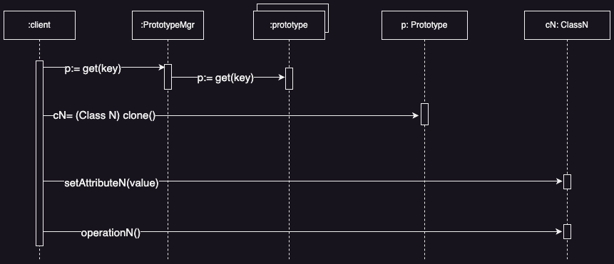
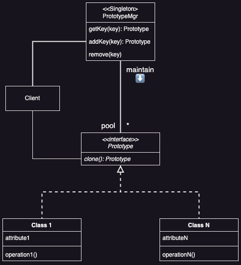

# Prototype Pattern

## Introduction
**Prototype** specifies the kinds of objects create using a prototypical instance, and create new objects by copying this prototype.

### Problem
How does one reduce the number of classes that share similar behaviour and relationships? How does one create an exact copy of an object?

### Solution
Define a class to replace all the classes that share similar behaviour and relationships. Save instances, called prototypes, of this class. To create an instance of any of the classes replaced, simply clone the desired prototype and modify its attributes.

## Applicability

Use the prototype pattern when you want:

* ***Independence***
   * You want a system where *how products are created and used* is flexible

* ***Dynamic Loading***
    * You need classes to be chosen and loaded during runtime

* ***Hierarchy Avoidance***
  * You want to avoid creating a hierarchy of factories for every product

* ***State Variation***
  * Instances of a class can have only a few different states, making it easier to clone prototypes than creating them manually

&nbsp;&nbsp;&nbsp;&nbsp;In essence the *Prototype Pattern* helps create flexible systems where you can easily create and modify objects without tightly coupling them to their creation process or specific class.

## Benefits

&nbsp;&nbsp;&nbsp;&nbsp;With *prototypes,* you can easily add or remove new product types while your programming is running. Instead of rigidly defining each product class, you can register a prototype with the client. This flexibility sets *prototypes* apart from other methods because you can adjust your product lineup dynamically, even while the program is running.

> [!NOTE]
> Easy to add and remove products at runtime.

&nbsp;&nbsp;&nbsp;&nbsp;In very flexible systems, you can create new behaviors by combining objects and settings their values, rather than making entirely new classes. Instead of defining whole new types of objects, you can create them by tweaking existing ones and marking them as prototypes. This way, a client can borrow behaviors from these prototypes and adapt them as needed. Equivalent to building new things with LEGO blocks rather than designing entirely new toys from scratch.

> [!NOTE]
> Creating new objects by changing values

&nbsp;&nbsp;&nbsp;&nbsp;With this design, users can make new classes without needing to code. Essentially, cloning a *prototype* is like making a new instance of a class. Using the *Prototype Pattern* can significantly cut down the total number of classes your system requires. Equivalent to having a library of LEGO instructions where you can make new models by following existing designs.

> [!TIP]
> Improves efficiency of complex object creation because cloning may be more efficient than constructing the object

&nbsp;&nbsp;&nbsp;&nbsp;*Factory Method* often produces a hierarchy of *Creation* classes that parallels the product class hierarchy. The *Prototype* pattern lets you clone a prototype instead of asking a factory method to make a new object.

> [!NOTE]
> Reduces the number of classes

&nbsp;&nbsp;&nbsp;&nbsp;In certain environments, you can add classes to an application while it's running. These classes are automatically instantiated when loaded and managed by a *prototype manager/registry*. The application can the request instances of these dynamically added classes from the manager, even if they weren't part of the original program. Equivalent to adding new tools to your toolbox while you're working and being able to use them right away.

> [!NOTE]
> Supports dynamically loaded classes (DLC), which cannot be referenced at compile time


## Liabilities
&nbsp;&nbsp;&nbsp;&nbsp;The main issue with the Prototype pattern is that every subclass of Prototype needs to implement the clone() operation, which can be tricky. For instance, it's challenging when internal objects don't support copying or have circular references.

> [!CAUTION]
> Implementing clone can be difficult with circular dependencies or nested objects without copy method

### Sequence Diagram

<div style="text-align:center">
  
</div>

### Class Diagram

<div style="text-align:center">
  
</div>

## Code Example

### Scenario 

&nbsp;&nbsp;&nbsp;&nbsp;In my opinion this is a common scenario in order to make sense of *Prototype*. Here is the scenario:

&nbsp;&nbsp;&nbsp;&nbsp;Let use the example from the [Abstract Factory Example](../abstract_factory/README.md). Remember that the [Abstract Factory](../abstract_factory/README.md) requires a concrete factory subclass for each product family (even if the products differ slightly). Let us remove the *BeverageFactory's* and *ToppingFactory's* *ConcreteFactory* subclass and replace it with a *PrototypeFactory*. 

```java

// Abstract Product A: Beverage
// This can also be an abstract class if desired
public interface Beverage { 
    String getBeverageType();
    void setBeverageType(String type);
    void serve();
    Beverage cloneBeverage();
}

// Concrete Product A1: Coffee
public class Coffee implements Beverage { 
    private String coffeeType;

    public Coffee() {
        this.coffeeType = "Prototype Coffee";
    }
    
    @Override
    public String getBeverageType() {
        return this.coffeeType;
    }

    @Override
    public void setBeverageType(String type) {
        this.coffeeType = type;
    }
    
    @Override 
    public void serve() {
        System.out.println("Here's your " + this.beverageDetail + " coffee!");
    }

    @Override
    public Beverage cloneBeverage() {
        return new Coffee(this.coffeeRoast);
    }
}


// Concrete Product A2: Tea
public class Tea implements Beverage { 
    private String teaType;

    public Tea() {
        this.teaType = "Prototype Coffee";
    }
  
    @Override
    public String getBeverageType() {
        return this.teaType;
    }
  
    @Override
    public void setBeverageType(String type) {
        this.teaType = type;
    }
  
    @Override
    public void serve() {
        System.out.println("Here's your " + this.teaType + " coffee!");
    }
  
    @Override
    public Beverage cloneBeverage() {
        return new Coffee();
    }
}

```

```java
// Abstract Product B: Topping
public interface Topping { 
    String getToppingName();
    void setToppingName(String name);
    void add();
    Topping cloneTopping();
}

// Concrete Product B1: Milk
public class Milk implements Topping { 
    private String name;
    
    public Milk() {
        this.name = "Prototype Milk";
    }
    
    @Override
    public String getToppingName() {
        return this.name;
    }
    
    @Override
    public void setToppingName(String name) {
        this.name = name;
    }
    
    @Override 
    public void add() {
        System.out.println("Adding " + this.name + " Milk...");
    }

    @Override
    public Topping cloneTopping() {
        return new Milk();
    }
}

// Concrete Product B2: Sugar
public class Sugar implements Topping {
    String name;
    
    public Sugar() {
        this.name = "Prototype Sugar";
    }

    @Override
    public String getToppingName() {
        return this.name;
    }

    @Override
    public void setToppingName(String name) {
        this.name = name;
    }
    
    @Override
    public void add() {
        System.out.println("Adding " + this.name + " Sugar...");
    }

    @Override
    public Topping cloneTopping() {
        return new Sugar();
    }
}
```

```java
/**
 * HERE WE ARE GOING TO DEFINE ONE FACTORY FOR THE PRODUCT FAMILIES DEFINED ABOVE.
 * IN THE ABSTRACT FACTORY EXAMPLE WE HAD TWO CONCRETE FACTORY SUBCLASSES.
 * WE WANT ONLY ONE!
 */

// Abstract Factory: ProductFactory
public interface ProductFactory {
  Beverage createBeverage();
  Topping createTopping();
}

// Concrete Factory: PrototypeFactory
public class PrototypeFactory implements ProductFactory { 
    private BeveragePrototype beveragePrototype;
    private ToppingPrototype toppingPrototype;

    public PrototypeFactory(BeveragePrototype bp, ToppingPrototype tp) {
        this.beveragePrototype = bp;
        this.toppingPrototype = tp;
    }

    @Override
    public Beverage createBeverage() {
        return (Beverage) beveragePrototype.cloneBeverage();
    }

    @Overrride
    public Topping createTopping() {
        return (Topping) toppingPrototype.cloneTopping();
    }
}
```

```java
// Client: Customer
public class Customer { 
    private final Beverage beverage;
    private final Topping topping;
    
    public Customer(ProductFactory beverageFactory) {
        this.beverage = beverageFactory.createBeverage();
        this.topping = beverageFactory.createTopping();
    }
    
    public void order(String beverage, String topping) {
        beverage.setBeverageType(beverage);
        topping.setToppingName(topping);
    }

    public void enjoy() {
        beverage.serve();
        topping.add();
    }
}
```

```java
public class Main { 
    public static void main(String[] args) {
        // Create Prototypes
        Beverage coffeePrototype = new Coffee();
        Beverage teaPrototype = new Tea();
        Topping milkPrototype = new Milk();
        Topping sugarPrototype = new Sugar();

        PrototypeFactory coffeeMilkFactory = new PrototypeFactory(coffeePrototype, milkPrototype);
        PrototypeFactory teaSugarFactory = new PrototypeFactory(teaPrototype, sugarPrototype);
      
        Customer coffeeLover = new Customer(coffeeMilkFactory);
        Customer teaLover = new Customer(teaSugarFactory);

        // Change attribute of Prototype and perform operations
        coffeeLover.order("dark roast", "Almond");
        coffeeLover.enjoy();
        teaLover.order("earl grey", "Brown");
        teaLover.enjoy();
  }
}
```

## Implementation Notes

### Using a Prototype Manager/Registry

&nbsp;&nbsp;&nbsp;&nbsp;When your system has changing prototypes, instead of handling them individually, you can use a *Prototype Manager*. This manager keeps track of all available prototypes. WHen a client needs a prototype, it asks the manager for it before making a copy.

&nbsp;&nbsp;&nbsp;&nbsp;A prototype manager is like a storage system where you can find prototypes based on a key. You can add or remove prototypes from this storage. Client's can interact with this storage during runtime, which helps them expand and check what's available in the system without needing to write extra code.

```java
// Prototype Manager: PrototypeManger
class PrototypeManager {
    private Map<String, Beverage> beverageMap = new HashMap<>();
    private Map<String, Topping> toppingMap = new HashMap<>();
    
    public void registerBeverage(String key, Beverage beverage) {
        beverageMap.put(key, beverage);
    }
    
    public void registerTopping(String key, Topping topping) {
        toppingMap.put(key, topping);
    }
    
    public Beverage getBeverageClone(String key) {
        if (beverageMap.containsKey(key))
            return beverageMap.get(key);
        else 
            return null;
    }
    
    public Topping getToppingClone(String key) {
        if (toppingMap.containsKey(key))
            return toppingMap.get(key);
        else
            return null;
    }
    
}
```

### Implementing the "clone" method

&nbsp;&nbsp;&nbsp;&nbsp;The hardest part of the Prototype pattern is implementing the Clone operation correctly. It's particular tricky when object structures contain circular references.

&nbsp;&nbsp;&nbsp;&nbsp;Most languages provide some support for cloning objects. C++ provides a copy constructor, but these do not solve the "shallow copy" vs "deep copy" problem. That is, does cloning an object in turn clone its instance variables, or do the clone and original just share the variables?


&nbsp;&nbsp;&nbsp;&nbsp;A shallow copy is straightforward and usually works fine. In C++, the default copy constructor copies member variables directly, so if you have pointers, they will be shared between the original and the copy. However, when you're cloning prototypes with complex structures, you often need a deep copy. This means the clone and the original must be completely separate. So, you need to make sure that everything inside the clone is also cloned from the original. Cloning makes you decide what, if anything, should be shared.

```java
public class Investment implements ProductCloneInterface {
    String symbol;
    int quantity;
    
    public Investment(String symbol, int quantity) {
        this.symbol = symbol;
        this.quantity = quantity;
    }
    
    @Override
    public ProductCloneInterface cloneInvestment() {
        return new Investment(this.symbol, this.quantity);
    }
}

public class Stock implements ProductCloneInterface {
    String name;
    Investment investment;
    
    public Stock(String name, Investment investment) {
        this.name = name;
        this.investment = investment;
    }
    
    @Override
    public ProductCloneInterface cloneShallowCopyProduct() {
        // the new instance of Stock and this instance of stock share the same pointer for Investment
        return new Stock(this.name, this.investment);
    }
    
    @Override
    public ProductCloneInterface cloneDeepCopyProduct() {
        return new Stock(this.name, new Investment(this.investment.cloneInvestment()));
    }
} 
```

## Related Patterns

* *Prototype* has many of the same benefits and liabilities that *Abstract Factory* and *Builder* have: it hides the concrete product classes from the client, thereby **reducing the number of names clients know about**. Moreover, these patterns let a client work with application-specific classes without modification.

* *Flyweight* reduces the number of instances of a class, while *Prototype* reduces the number of classes. They can be used together to conquer both objectives.

* *Abstract Factory* may use *Prototype* to create products.