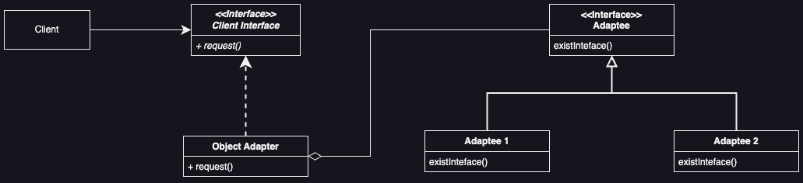

# Adapter Pattern

## Introduction

Convert the interface of a class into another interface clients expect. *Adapter* lets classes work together that couldn't otherwise because of incompatible interfaces.

## Problem

How to convert one interface to another?

## Solution

Define an interface to match the one expected and let the implementing subclass adapt it to the existing interface.

## Applicability

* ***Mismatch interfaces***
  * Imagine you have a class (let's call it Class A) that works perfectly fine, but its way of doing things doesn't quite match what you need for your current project. You could change Class A directly, but maybe it's used in parts of your code and don't want to mess those up. So, instead you create a new class (let's call it Adapter) that acts as a middleman, making Class A's interface look like what you need

* ***Reusable Solution for Different Classes***
  * Sometimes you have different classes that do their own thing, but you want to make them work together smoothly. You can create an adapter that knows how to talk to each of these classes, even if they are completely different from each other.

* ***Adapting Many Classes Easily***
  * If you have lots of classes(let's call them Class B, Class C, Class D, and so on) that you need to work with, and they all have their unique way of doing things, it's pain to create separate adapters for each one. Instead, you can use an object adapter. This type of adapter can handle all these different classes without needing to create a bunch of subclasses for each one. It's like having a super versatile adapter that can adapt to whatever you throw at it. 

## Benefits

### Class Adapter Benefits (Mechanism: Inheritance)

* **Reuse Code**: Adapter pattern lets you reuse existing class code (adaptee)

* **Custom Behavior**: Adapter can tweak adaptee behavior without changing its code

* **Clear Runtime Behavior**: Easy to understand how adapter works during runtime

* **Minimal Objects**: Each class adapter introduces only one adapter object

Use Class Adapter if:
1.  The adapter needs to adapt only one adaptee class AND

2. No other adaptee class is anticipated

### Object Adapter Benefits (Mechanism: Object Composition)

* **Dynamic Adaptation**: Object Adapter can adjust on the fly with different adaptee classes

* **Additional Functionality**: Adapter can add extra features beyond what the adaptee offers

* **Subclass Adaptation**: Can create subclasses of adaptee, tweaking or overriding its behaviour as needed

* **Dynamic Behaviour**: Adapter's behaviour can switch dynamically by changing the adaptee object it works with

Use Object Adapter if:
1. The adapter needs to adapt to different adaptee classes or objects.

2. Other adaptee classes or objects are anticipated.

3. The behaviour of the adapter must change execution time.

## Liabilities

### Class Adapter Liabilities (Mechanism: Inheritance)

* **Static Binding Limitation**: Class adapter is limited by static binding to a specific adaptee class, hindering its ability to adapt to other classes

* **Encapsulation Breakage**: Adapter pattern can break encapsulation as it allows the adapter to override adaptee class behaviour

* **Final Class Constraint**: If adaptee class is marked final, class adapter can't be used

* **Inheritance Dependency**: Using inheritance means the adapter class depends on the adaptee class, so changes to adaptee may affect the adapter

### Object Adapter Liabilities (Mechanism: Object Composition)

* **Behaviour Override**: Object adapter makes it less straightforward to override adaptee class behaviour

* **Complex Runtime Behaviour**: Understanding runtime behaviour can be tricky as the adapter dynamically adapts any class in the adaptee hierarchy

* **Creation Overhead**: Object adapter needs at least one adapter object and one adaptee object, adding to creation complexity

## UML

### Class Adapter UML

<div style="text-align:center">
  
</div>

### Object Adapter UML

<div style="text-align:center">
  
</div>

## Code Example

**Scenario**: Currently we have a logging system that can log two data representation types: JSON and YAML. We are currently working with an API that returns XML data to us. We want this XML formatted data to be able to work with our JSON and YAML systems.

### Class Adapter Code Example

```java
// Adaptee JSON Format
public class JsonLogger  {
    public void log(String data) {
        System.out.println("Logging JSON data: ");
        System.out.println("{message: " + data + " JSON}");
    }
}

// Adaptee YAML Format
public class YamlLogger {
    public void log(String data) {
        System.out.println("Logging YAML data: ");
        System.out.println("message: " + data + " YAML");
    }
}
```

```java
// Data Class Representing XML
public class XmlData { 
    public String data;
    public XmlData(String xmlData) {
        this.data = xmlData;
    }
}

// Client/Target Interface
public interface XmlLogger { 
    void logXmlData(XmlData xmlData);
}

// Adapter Using Inheritance
public class XmlToJsonAdapter extends JsonLogger implements XmlLogger {
    @Override
    public void logXmlData(XmlData xmlData) {
        // Use a regular expression to find the content between the <message> tags
        Pattern pattern = Pattern.compile("<message>(.*?)</message>");
        Matcher matcher = pattern.matcher(xmlData.data);
        
        if (matcher.find()) {
            String messageContent = matcher.group(1);
            super.log(messageContent);
        } else {
            System.out.println("Data is not XML formatted");
        }
    }
}

// Adaptee using Inheritance
// Notice how the logXmlData is exactly the same as the XmlToJson
public class XmlToYamlAdapter extends YamlLogger implements XmlLogger {
    @Override
    public void logXmlData(XmlData xmlData) {
        // Use a regular expression to find the content between the <message> tags
        Pattern pattern = Pattern.compile("<message>(.*?)</message>");
        Matcher matcher = pattern.matcher(xmlData.data);

        if (matcher.find()) {
            String messageContent = matcher.group(1);
            super.log(messageContent);
        } else {
            System.out.println("Data is not XML formatted");
        }
    }
}
```

```java
// Client
public class Main {
    public static void main(String[] args) {
        XmlLogger jsonLogger = new XmlToJsonAdapter();
        XmlLogger yamlLogger = new XmlToYamlAdapter();
        
        XmlData xmlToJson = new XmlData("<message>Hello I am a message from XML server being logged as</message>");
        XmlData xmlToYaml = new XmlData("<message>Hello I am a message from XML server being logged as</message>");
        
        jsonLogger.logXmlData(xmlToJson);
        yamlLogger.logXmlData(xmlToYaml);
    }
}
```

### Object Adapter Code Example

```java
// Adaptee Interface (Represents existing system)
public interface Logger {
    void log(String data);
}

// Adaptee JSON Implementation of Adaptee Interface
public class JsonLogger implements Logger {
    @Override
    public void log(String data) {
        System.out.println("Logging JSON data: ");
        System.out.println("{message: " + data + "}");
    }
}

// Adaptee YAML Implementation of Adaptee Interface
public class YamlLogger implements Logger {
    @Override
    public void log(String data) {
        System.out.println("Logging YAML data: ");
        System.out.println("message: " + data);
    }
}
```

```java
// Data Class Representing XML
public class XmlData { 
    public String data;
    public XmlData(String xmlData) {
        this.data = xmlData;
    }
}

// Client/Target Interface
public interface XmlLogger {
    void logXmlData(XmlData xmlData);
    void setLogger(Logger logger);
}

// Adapter Implementation of XmlLogger
public class XmlToJsonYamlAdapter implements XmlLogger {
    private Logger logger;
    
    public XmlToJsonYamlAdapter(Logger logger) {
        this.logger = logger;
    }
    
    @Override
    public void logXmlData(XmlData xmlData) {
        // Use a regular expression to find the content between the <message> tags
        Pattern pattern = Pattern.compile("<message>(.*?)</message>");
        Matcher matcher = pattern.matcher(xmlData.data);
        
        if (matcher.find()) {
            String messageContent = matcher.group(1);
            logger.log(messageContent);
        } else {
            System.out.println("Data is not XML formatted");
        }
    }
    
    @Override
    public void setLogger(Logger logger) {
        this.logger = logger;
    }
}
```

```java
public class Main {
    public static void main(String[] args) {
        Logger jsonLogger = new JsonLogger();
        Logger yamlLogger = new YamlLogger();
        
        XmlLogger xmlLogger = new XmlToJsonYamlAdapter(jsonLogger);
        XmlData responseFromServer1 = new XmlData("<message>Hello I am a message from XML server being logged as JSON</message>");
        xmlLogger.logXmlData(responseFromServer1);
        
        xmlLogger.setLogger(yamlLogger);
        XmlData responseFromServer2 = new XmlData("<message>Hello I am a message from XML server being logged as YAML</message>");
        xmlLogger.logXmlData(responseFromServer2);
    }
}
```

## Implementation Notes

### Implementing Class Adapters  (C++ vs Java)

In a class adapter pattern in C++ the adapter class `Adapter` would:
* **Publicly Inherit from Client Interface**
   * This means `Adapter` would act as a subtype of `Client Interface`, making it compatible with any client expecting a `Client Interface`

* **Privately Inherit from Adaptee**
  * This means `Adapter` would use the functionality of `Adaptee` without exposing `Adoptee`'s interface to the outside world. The adapter would internally use the `Adaptee`'s methods to fulfill the `Client Interface` requirements

> [!NOTE]
> Since Java does not support multiple inheritance directly (like C++) we can simulate the concept by using interfaces and extending a class. We'll make the `Adapter` publicly implement the `Client Interface` and use composition to privately use the `Adapter`

### Pluggable Adapters

Simplifying Adaptee Interface for Adapter PatternWhen using the Adapter pattern, the first step is to identify the essential methods needed from the existing class (Adaptee). This "narrow" interface should include only a few key methods. A simpler interface makes it easier to create an adapter.


#### Using Abstract Operations

In this approach, we define abstract methods in the adapter interface that correspond to the operations needed from the Adaptee. Concrete adapters implement these methods by calling specific operations of the Adaptee.

```java
// Adapter Interface
public interface Adapter {
    void operation1();
    void operation2();
}

// Adaptee Interface
public interface Adaptee {
    void specificOperation1();
    void specificOperation2();
}

// Concrete Adapter
public class ConcreteAdapter implements Adapter {
    private final Adaptee adaptee;
    
    public ConcreteAdapter(Adaptee adaptee) {
        this.adaptee = adaptee;
    }
    
    @Override
    public void operation1() {
        adaptee.specificOperation1();
    }
    
    @Override
    public void operation2() {
        adaptee.specificOperation2();
    }
}
```

#### Using Delegate Objects

Here, the adapter class contains an instance of the Adaptee. The adapter methods simply delegate the calls to the corresponding methods of the Adaptee instance.

```java
// Adapter Class
public class Adapter {
    private final Adaptee adaptee;
    
    public Adapter(Adaptee adaptee) {
        this.adaptee = adaptee;
    }
    
    public void operation1() {
        adaptee.specificOperation1();
    }
    
    public void operation2() {
        adaptee.specificOperation2();
    }
}
```

#### Parameterized Adapters

This approach allows us to pass the Adaptee object as a parameter to the adapter methods. The adapter methods directly call the specific operations of the Adaptee

```java
// Adapter Class
public class Adapter {
    public void operation1(Adaptee adaptee) {
        adaptee.specificOperation1();
    }
    
    public void operation2(Adaptee adaptee) {
        adaptee.specificOperation2();
    }
}
```

## Related Patterns

* Bridge separates how something looks from how it works. It lets you change either side without messing up the other. Unlike an adapter that changes the interface of an existing object, the bridge doesn't alter the interface; it keeps it intact while providing a way to vary both sides independently.

* Decorator adds extra stuff to an object without changing its core. It's like adding toppings to a cake to make it yummier. Unlike an adapter that changes the interface, a decorator enhances the object transparently and supports adding more enhancements recursively.

* Proxy stands in for another object. It handles requests on behalf of the original object, adding extra functionality if needed. Unlike an adapter that changes the interface, a proxy maintains the original interface but may perform additional tasks like access control or logging.