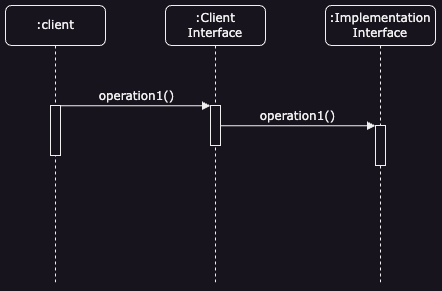
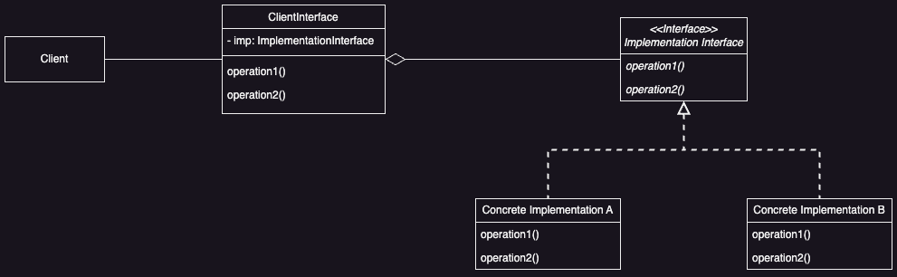

# Bridge Pattern

## Intent

Decouple an abstraction from its implementation so that the two can vary independently.

## Problem

How does one maintain a stable client interface while the implementation changes?

## Solution

Decouple the implementation from the client interface, so they change independently. The Bridge pattern attempts to solve the problem by switching from inheritance to the object composition.

## Applicability 

* ***Runtime Implementation Selection***
  * You need to allow selecting or switching an implementation at runtime, avoiding a fixed link between an abstraction and its implementation.

* ***Independent Extensibility***
  * Both abstractions and implementations should be easily extendable. The bride pattern helps you combine and extend them independently.

* ***Client Code Stability***
  * Implementation changes should not affect client code, ensuring no need for recompilation.

* ***Implementation Encapsulation***
  * You want to completely hide an abstraction's implementation details from clients, especially important languages like C++.

* ***Simplifying Complex Hierarchies***
  * A large number of classes indicate the need to separate an object into two parts, simplifying complex hierarchies.

* ***Shared Implementation Management***
  * You need to share an implementation among multiple objects, hiding this detail from the client. An example is a logging framework where multiple logger instances share the same logging backend.

## Benefits

* ***Decoupling Interface and Implementation***
  * The implementation is not permanently bound to an interface, allowing runtime configuration or changes.

* ***Reduced Compile-Time Dependencies***
  * Changing an implementation class doesn't require recompiling the abstraction class and its clients, ensuring binary compatibility across different versions of a class library.

* ***Layered Architecture***
  * Encourages better system structure, as high-level components only need to know about the abstraction and implementor, not their specific implementations.

* ***Improved Extensibility***
  * The abstraction and implementor hierarchies can be extended independently, allowing more flexible and modular code development.

* ***Hiding Implementation Details***
  * Clients are shielded from implementation specifics, such as object sharing and reference counting mechanisms.

## Liabilities

* **Increased Complexity**
  * Introducing the bridge pattern adds extra layers of abstraction, which can complicate the codebase and make it harder to understand for new developers.

## UML

### Sequence Diagram



### Class Diagrams



## Code Example

**Scenario**: You want to access two different database implementations at runtime. One set of data requires you to query mysql and other set is in PostgresSQL. You also do not want to change the client code when you have made changes to either implementation.

```java
// Implementation Interface
public interface DatabaseDriver {
    void connect();
    void disconnect();
    void executeQuery(String query);
}

// Concrete Implementation A
public class MySqlDriver implements DatabaseDriver {
    @Override
    public void connect() {
        System.out.println("Connecting to MYSQL database...");
    }

    @Override
    public void disconnect() {
        System.out.println("Disconnecting from MYSQL database...");
    }

    @Override
    public void executeQuery(String query) {
        System.out.println("Executing MYSQL query: " + query);
    }
}

// Concrete Implementation B
public class PostrgreSqlDriver implements DatabaseDriver {
    @Override
    public void connect() {
        System.out.println("Connecting to PostgreSQL database...");
    }

    @Override
    public void disconnect() {
        System.out.println("Disconnecting from PostgreSQL database...");
    }

    @Override
    public void executeQuery(String query) {
        System.out.println("Executing PostgreSQL query: " + query);
    }
}
```

```java
// Client Interface
// Note the source code has a different implementation ApplicationDatabase
// It is just another way to implement the ClientInterface in regard to Bridge
public class ApplicationDatabase {
    protected DatabaseDriver databaseDriver;
    
    public ApplicationDatabase(DatabaseDriver databaseDriver) {
        this.databaseDriver = databaseDriver;
    }

    public void connect() {
        databaseDriver.connect();
    }
    
    public void disconnect() {
        databaseDriver.disconnect();
    }
    
    public void executeQuery(String query) {
        databaseDriver.executeQuery(query);
    }
    
    public void setDatabaseDriver(DatabaseDriver databaseDriver) {
        this.databaseDriver = databaseDriver;
    }
}
```

```java
public class Main {
    public static void main(String[] args) {
        ApplicationDatabase db = new ApplicationDatabase(new MySqlDriver());
        db.connect();
        db.executeQuery("SELECT * from tableInMySqlDatabase;");
        db.disconnect();
        
        db.setDatabaseDriver(new PostgreSqlDriver());
        db.connect();
        db.executeQuery("SELECT * FROM orders");
        db.disconnect();
        
    }
}
```

## Implementation Notes

### Single Implementor/Implementation Interface Case

If there's only **one implementation**, you don't need an abstract *Implementor/Implementation Interface* class. This still separates the abstraction from the implementation, so changes in implementation don't affect clients.

```java
public class SingleDatabase {
    public void connect() {
        System.out.println("Connecting the single database...");
    }
}

public class DatabaseClient {
    private SingleDatabase singleDatabase;
    
    public DatabaseClient() {
        this.singleDatabase = new SingleDatabase();    
    }
    
    public void connect() {
        singleDatabase.connect();
    }
}
```

### Choosing the Implementor/Implementation Interface

Decide which *Implementor* to use based on parameters passed to the *Abstraction's/Client Interface's* constructor or by switching implementations as needed.

```java
// Implementor/Implementor Interface
interface Renderer {
    void render(String shape);
}

// Concrete Implementation A
class VectorRenderer implements Renderer {
    public void render(String shape) {
        System.out.println("Rendering " + shape + " as vectors.");
    }
}

// Concrete Implementation B
class RasterRenderer implements Renderer {
    public void render(String shape) {
        System.out.println("Rendering " + shape + " as raster.");
    }
}

// Client Interface
abstract class Shape {
    protected Renderer renderer;

    public Shape(Renderer renderer) {
        this.renderer = renderer;
    }

    public abstract void draw();
}

// Refined Client Interface
class Circle extends Shape {
    public Circle(Renderer renderer) {
        super(renderer);
    }

    public void draw() {
        renderer.render("Circle");
    }
}

// Client
public class BridgePatternDemo {
    public static void main(String[] args) {
        Renderer vectorRenderer = new VectorRenderer();
        Renderer rasterRenderer = new RasterRenderer();

        Shape circle1 = new Circle(vectorRenderer);
        circle1.draw();

        Shape circle2 = new Circle(rasterRenderer);
        circle2.draw();
    }
}
```

### Sharing Implementors

Use a reference count to share implementations among objects.

```java
class SharedResource {
    private int refCount = 0;

    public void addRef() {
        refCount++;
    }

    public void release() {
        if (--refCount == 0) {
            System.out.println("Releasing shared resource.");
        }
    }
}

class SharedResourceClient {
    private SharedResource resource;

    public SharedResourceClient(SharedResource resource) {
        this.resource = resource;
        this.resource.addRef();
    }

    public void useResource() {
        System.out.println("Using shared resource.");
    }

    public void close() {
        resource.release();
    }
}

public class BridgePatternDemo {
    public static void main(String[] args) {
        SharedResource resource = new SharedResource();
        SharedResourceClient client1 = new SharedResourceClient(resource);
        SharedResourceClient client2 = new SharedResourceClient(resource);

        client1.useResource();
        client2.useResource();

        client1.close();
        client2.close();
    }
}
```

### Multiple Inheritance Limitation

In C++ you can use multiple inheritance to combine an interface with its implementation, but it **permanently binds the implementation to the interface** thus not allowing a true Bridge Pattern.

## Related Patterns

* **Abstract Factory**
  * Can be used to create and configure a specific bridge.

* **Adapter vs. Bridge**
  * The Adapter pattern makes unrelated classes work together, typically applied after system design. In contrast, the Bridge pattern is used early in the design process to allow independent variation of abstractions and implementations.