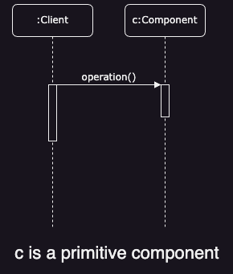
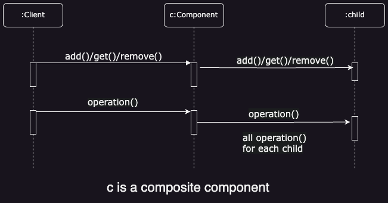
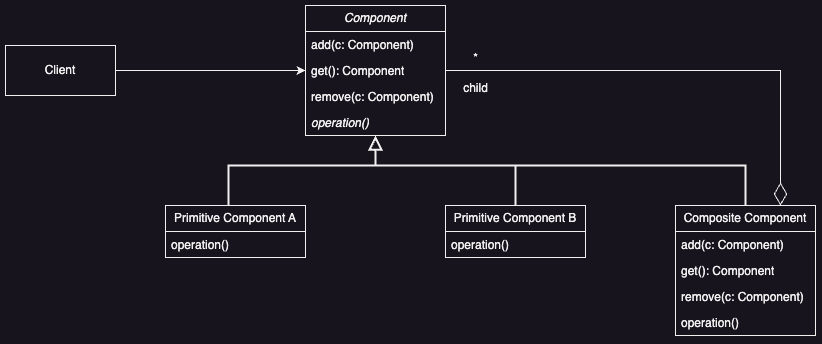
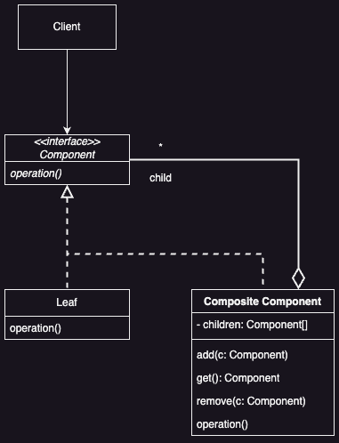

# Composite Pattern

## Intent

Compose objects into tree structures to represent *part-whole hierarchies*. Composite lets clients treat individual objects and compositions of objects uniformly.

## Problem

How to represent recursive part-whole relationships, and all the client to interact with primitive as well as composite components uniformly?

## Solution

Define a common interface to unify the primitive and composite components so that the client can access them uniformly.

## Applicability

* ***Modeling Hierarchical Structures***
  * You need to model systems where objects contain other objects, representing them as a hierarchy or tree structure.

* ***Uniform Object Handling***
  * You want your code to work the same way whether dealing with single objects or groups of objects, allowing clients to interact with all objects n the hierarchy consistently.

## Benefits

* ***Simplifies Object Structures***
  * Allows creating complex objects from simpler ones, and those complex objects can be used wherever simpler ones are expected.

* ***Uniform Object Handling***
  * Clients can interact with both single objects and group objects in the same way, reducing the need for complex conditionals in client code.

* ***Effortless Expansion***
  * Adding new types of objects is straightforward and doesn't require changes to existing code.

## Liabilities

* ***Limited Type Enforcement***
  * While it's easy to add new components, ensuring that only specific types of components are used can be difficult, often requiring run-time checks instead of compile time checks.

* ***Client Responsibility for Consistency***
  * Clients must ensure that the relationships between components are maintained correctly. For example, if a component is removed, the client must also manage and update any related components to maintain the system's integrity.

## UML

### Sequence Diagram Primitive Component



### Sequence Diagram Composite Component



### Class Diagram 



### Alternate Class Diagram



## Code Example

**Scenario**: Imagine you are developing a file management system that needs to handle both individual files and directories containing files or other directories. You want to perform operations like displaying the structure of the file system in a uniform manner, regardless of whether you're dealing with individual files or nested directories.

```java
// Component
// Can be an interface or an abstract class. This case is an abstract class
public abstract class FileSystemComponent {
    public void add(FileSystemComponent component) {
        throw new UnsupportedOperationException();
    }
    
    public void remove(FileSystemComponent component) {
        throw new UnsupportedOperationException();
    }
    
    public FileSystemComponent getChild(int idx) {
        throw new UnsupportedOperationException();
    }
    
    public String getName() {
        throw new UnsupportedOperationException();
    }
    
    public void display() {
        throw new UnsupportedOperationException();
    }
}
```

```java
// Leaf or Primitive Component A/B
public class File extends FileSystemComponent {
    private final String name;
    
    public File(String name) {
        this.name = name;
    }
    
    @Override
    public String getName() {
        return this.name;
    }
    
    @Override
    public void display() {
        System.out.println("File: " + this.name);
    }
}
```

```java
// Composite Component/Composite
public class Directory extends FileSystemComponent {
    private final String name;
    private final List<FileSystemComponent> components;
    
    public Directory(String name) {
        this.name = name;
        this.components = new ArrayList<>();
    }
    
    @Override
    public void add(FileSystemComponent component) {
        this.components.add(component);
    }
    
    @Override
    public void remove(FileSystemComponent component) {
        this.components.remove(component);
    }
    
    @Override
    public FileSystemComponent getChild(int idx) {
        return this.components.get(idx);
    }
    
    @Override
    public String getName() {
        return this.name;
    }
    
    @Override
    public void display() {
        System.out.println("Directory: " + this.name);
        for (FileSystemComponent component : this.components)
            component.display();
    }
}
```

```java
// Client
public class Main {
    public static void main(String[] args) {
        FileSystemComponent file1 = new File("File1.txt");
        FileSystemComponent file2 = new File("File2.txt");
        FileSystemComponent file3 = new File("File3.txt");
        
        Directory directory1 = new Directory("Directory1");
        Directory directory2 = new Directory("Directory2");
        
        directory1.add(file1);
        directory1.add(file2);
        
        directory2.add(file3);
        directory2.add(directory1);
        
        directory2.display();

    }
}
```

## Implementation Notes

### Use Parent References

Having a reference from child components to their parent makes it easier to manage and traverse the composite structure. It also supports patterns like *Chain of Responsibility*. Define the parent reference in the `Component` class. Both `Leaf` and `Composite` classes will inherit this reference and the methods to manage it. Always update the parent reference when adding or removing components. This ensures all children have the correct parent. Implement this logic in the `add` and `remove` methods of the `Composite` class to automatically maintain the correct parent references

```java
public abstract class Component {
    protected Component parent;
    
    public void setParent(Component parent) {
        this.parent = parent;
    }
    
    public Component getParent() {
        return this.parent;
    }
    
    public void add(Component component) {
        throw new UnsupportedOperationException();
    }
    
    public void remove(Component component) {
        throw new UnsupportedOperationException();
    }
    
    public abstract void display();
}

public class Leaf extends Component {
    private final String name;
    
    public Leaf(String name) {
        this.name = name;
    }
    
    @Override
    public void display() {
        System.out.println("Leaf: " + this.name);
    }
}

public class Composite extends Component {
    private final List<Component> children;
    private final String name;
    
    public Composite(String name) {
        this.name = name;
    }
    
    @Override
    public void add(Component component) {
        component.setParent(this);
        children.add(component);
    }
    
    @Override
    public void remove(Component component) {
        component.setParent(null);
        children.remove(component);
    }
    
    @Override
    public void display() {
        System.out.println("Composite: " + this.name);
        for (Component component : this.children)
            component.display();
    }
}
```

### Sharing Components

Sharing components can save storage space, but it's tricky if a component can only have one parent. If you let a component have multiple parents, it can cause confusion when requests move up the structure. Use the **Flyweight** pattern to avoid storing parent references. This works when children don't need to send requests to their parents and can keep some or all of their state externally.

#### Flyweight Pattern Code Solution

Instead of each file storing its parent folders, use an external structure to manage these relationships.

```java
// Component Interface
abstract class Component {
    public void add(Component component) {
        throw new UnsupportedOperationException();
    }
    
    public void remove(Component component) {
        throw new UnsupportedOperationException();
    }
    
    public abstract void display();
}

// Leaf Component
class File extends Component {
    private String name;
    
    public File(String name) {
        this.name = name;
    }
    
    @Override
    public void display(){
        System.out.println("File: " + this.name);
    }
}

// Composite Component
class Folder extends Component {
    private List<Component> children;
    private String name;
    
    public Folder(String name) {
        this.name = name;
        this.children = new ArrayList<>();
    }
    
    @Override
    public void add(Component component) {
        children.add(component);
    }
    
    @Override
    public void remove(Component component) {
        children.remove(component);
    }
    
    @Override
    public void display() {
        System.out.println("Folder: " + this.name);
        for (Component child : children)
            child.display();
    }
}

// External Structure for managing parent-child relationships
class FileSystem {
    private List<Component> roots = new ArrayList<>();
    
    public void addRoot(Component component) {
        roots.add(component);
    }
    
    public void display() {
        for (Component root : roots)
            root.display();
    }
}

class FlyweightPatternDemo {
    public static void main(String[] args) {
        File file1 = new File("File1");
        File file1 = new File("File2");
        
        Folder folder1 = new Folder("Folder1");
        Folder folder2 = new Folder("Folder2");
        
        folder1.add(file1);
        folder2.add(file2);
        folder2.add(folder1);
        
        FileSystem fileSystem = new FileSystem();
        fileSystem.addRoot(folder2);
        
        fileSystem.display();
    }
}
```

### Maximizing the Component Interface

The goal of the Composite pattern ***is to make clients unaware of whether they are using a `Leaf` or `Composite` classes by defining common operations in the `Component` class***. The `Component` class provides default implementations for these operations, which `Leaf` and `Composite` classes can override as needed. While some operations might not seem relevant for `Leaf` classes, the `Component` class can still define them, allowing `Leaf` classes to inherit default behaviours and Composite classes to override them.

### Declaring the Child Management Operations

An important question in the Composite pattern is where to define `add` and `remove` methods for managing children. Should these methods be in the `Component` class, making them available to both `Leaf` and `Composite` classes, or should they be defined only in the `Composite` class and its subclasses?

The decision involves a trade-off between safety and transparency:
* Placing child management methods (`add` or `remove`) in the base `Component` class provides **transparency**, letting you treat all components the same way. However, it sacrifices safety because clients might try to add or remove children from leaf nodes, which doesn't make sense.
* Putting these methods only in the `Composite` class ensures safety, preventing such mistake at compile time in statically typed languages. But this approach loses transparency, as leaves and composites will have different interfaces.

GoF book emphasizes transparency over safety for the Composite pattern. Emphasizing safety means you may lose type information and have to perform a type cast. **How can you do this without resorting to a type-unsafe cast?**

```java
/**
 * The problem with this code, emphasizing safety over transparency, is
 * that we do not treat all components uniformly
 */


enum TypeComponent {
    LEAF,
    COMPOSITE
}

abstract class Component {
    // ......
    public TypeComponent getComposite() { return TypeComponent.LEAF; }
}

class Composite extends Component {
    @Override
    public TypeComponent getComposite() { return TypeComponent.COMPOSITE; }
}

class Leaf {
  // ......
}

class Main {
    public static void main(String[] args) {
        Component aComponent = new Composite();
        if (aComponent.getComposite() == TypeComponent.COMPOSITE) {
            // able to perform add and remove operation
            aComponent.add(new Leaf());
        }
    }
}
```

### Should Component implement a list of Components?

You might think about putting a list of children directly in the `Component` class, where the child management methods are. However, this means every leaf, which never has children, will waste space storing this list. This approach only makes sense if the structure has very few leaf nodes compared to composite nodes.

### Who should delete components?

In languages without garbage collection, it's usually best to make a Composite responsible for deleting its children when it's destroyed. An exception to this rule is when Leaf objects are immutable and thus can be shared.

## Related Patterns

* **Abstract Factory and Builder**
  * Can be used for creating primitive components and constructing complex composites.

* **Flyweight**
  * Lets you share components, but they can no longer refer to their parents.

* **Decorator**
  * Often used with Composite. When decorators and composites are used together, they will usually have a common parent class. So decorators will have to support the Component interface.