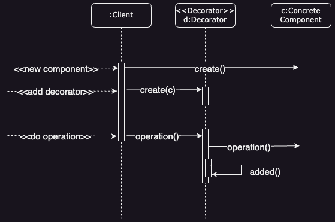
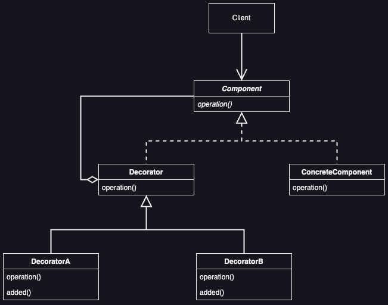

# Decorator Pattern

## Intent

Attach additional responsibilities to an object dynamically. Decorators provide flexible alternative to subclassing for extending functionality.

## Problem

How to add/remove functionality to/from existing objects freely and dynamically?

## Solution

Define an aggregate class of the existing class to provide the additional functionality. Define a common interface to hide the difference of the two classes.

## Applicability

* ***Dynamic Object Environment***
    * Add features to objects *on the fly* without changing other objects

* ***Reversible Features***
    * Easily add or remove functionalities

* ***Avoid Subclass Explosion***
  * Use when you can't subclass a class directly 
  * Prevent a huge number of subclasses when you need many combination of features

## Benefits

* **Greater Flexibility than Inheritance**
  * Add and remove responsibilities at runtime
  * Avoid creating a new class for every feature
  * Mix and match features easily

* **Avoids Feature-Laden Classes**
  * Use a simple base class with add-on features
  * Pay only for the features you use
  * Add new features without changing existing classes

## Liabilities

* **Non-Identical Decorator and Component**
  * Decorated objects aren't identical to the original objects
  * Avoid relying on object identity when using decorators

* **Many Small Objects**
  * Results in numerous similar-looking objects
  * Can be difficult to learn and debug

## UML

### Sequence Diagram



### Class Diagram



## Code Example

This example shows how you can adjust the behavior of an object without changing its code.

Initially, the business logic class could only read and write data in plain text. Then we created several small wrapper classes that add new behavior after executing standard operations in a wrapped object.

The first wrapper encrypts and decrypts data, and the second one compresses and extracts data.

You can even combine these wrappers by wrapping one decorator with another.

```java
// Component
public interface DataSource {
    void writeData(String data);
    String readData();
}
```

```java
// Concrete Implementation
public class FileDataSource implements DataSource {
    private String name;
    
    public FileDataSource(String name) {
        this.name = name;
    }
    
    @Override
    public void writeData(String data) {
        File file = new File(this.name);
        try (OutputStream fos = new FileOutputStream(file)) {
            fos.write(data.getBytes(), 0, data.length());
        } catch (IOException ex) {
            System.out.println(ex.getMessage());
        }
    }
    
    @Override
    public String readData() {
        File file = new File(this.name);
        try (FileReader reader = new FileReader(file)) {
            char[] buffer = new char[(int) file.length()];
            reader.read(buffer);
            return new String(buffer);
        } catch (IOException ex) {
            System.out.println(ex.getMessage());
            return null;
        }
    }
}
```

```java
// Base Decorator
public abstract class DataSourceDecorator implements DataSource {
    private DataSource wrappee;
    
    public DataSourceDecorator(DataSource source) {
        this.wrappee = source;
    }
    
    @Override
    public void writeData(String data) {
        wrappee.writeData(data);
    }
    
    @Override
    public String readData() {
        return wrappee.readData();
    }
}
```

```java
// Decorator A
public class EncryptionDecorator extends DataSourceDecorator {
    public EncryptionDecorator(DataSource source) {
        super(source);
    }
    
    @Override
    public void writeData(String data) {
        super.writeData(encode(data));
    }
    
    @Override
    public String readData() {
        return decode(super.readData());
    }
    
    private String encode(String data) {
        byte[] result = data.getBytes();
        for (int i = 0; i < result.length; i++)
            result[i] += (byte) 1;
        return Base64.getEncoder().encodeToString(result);
    }
    
    private String decode(String data) {
        byte[] result = Base64.getDecoder().decode(data);
        for (int i = 0; i < result.length; i++)
            result[i] -= (byte) 1;
        return new String(result);
    }
}
```

```java
// Decorator B
public class CompressionDecorator extends DataSourceDecorator {
    private int compLevel = 6;
    
    public CompressionDecorator(DataSource source) {
        super(source);
    }
    
    public int getCompressionLevel() {
        return this.compLevel;
    }
    
    public void setCompressionLevel(int value) {
        this.compLevel = value;
    }
    
    @Override
    public void writeData(String data) {
        super.writeData(compress(data));
    }
    
    @Override
    public String readData() {
        return decompress(super.readData());
    }
    
    private String compress(String stringData) {
        byte[] data = stringData.getBytes();
        try {
            ByteArrayOutputStream bout = new ByteArrayOutputStream(512);
            DeflaterOutputStream dos = new DeflaterOutputStream(bout, new Deflater(this.compLevel));
            dos.write(data);
            dos.close();
            bout.close();
            return Base64.getEncoder().encodeToString(bout.toByteArray());
        } catch (IOException ex) {
            return null;
        }
    }
    
    private String decompress(String stringData) {
        byte[] data = Base64.getDecoder().decode(stringData);
        try {
            InputStream in = new ByteArrayInputStream(data);
            InflaterInputStream iin = new InflaterInputStream(in);
            ByteArrayOutputStream bout = new ByteArrayOutputStream(512);
            int b;
            while ((b = iin.read()) != -1)
                bout.write(b);
            in.close();
            iin.close();
            bout.close();
            return bout.toString();
        } catch(IOException ex) {
            return null;
        }
    }
}
```

```java
public class Main {
    public static void main(String[] args) {
        String salaryRecords = "Name,Salary\nJohn Smith,100000\nSteven Jobs,912000";
        DataSourceDecorator encoded = new CompressionDecorator(
                new EncryptionDecorator(
                        new FileDataSource("OutputDemo.txt")
                )
        );
        
        encoded.writeData(salaryRecords);
        DataSource plain = new FileDataSource("OutputDemo.txt");
        
        System.out.println("- Input ----------------");
        System.out.println(salaryRecords + "\n");
        System.out.println("- Encoded ----------------");
        System.out.println(plain.readData() + "\n");
        System.out.println("- Decoded ----------------");
        System.out.println(encoded.readData());
        
        
    }
}
```

## Implementation Notes

### Interface Conformance

A decorator object's interface must conform to the interface of the component it decorates. `ConcreteDecorator` classes must therefore inherit from a common class.

### Omitting the Abstract Decorator Class

You can skip defining an abstract Decorator class if you only need to add one responsibility. This is often useful when working with an existing class hierarchy. Instead, you can directly integrate the request forwarding function into the `ConcreteDecorator` class.

### Keeping Component Classes Lightweight

Ensure components and decorators share a common, lightweight `Component` class focused on the interface, not data storage. Let subclasses handle data to keep the `Component` class simple and avoid making decorators too heavy. This approach also prevents concrete subclasses from inheriting unnecessary features.

### Changing the Skin of an Object Versus Changing its Guts

The Decorator pattern adds a "skin" to an object, changing its behavior externally. In contrast, the Strategy pattern changes the object's "guts" by delegating some behavior to a separate strategy object. Use the Strategy pattern when the `Component` class is too heavy for decorators. This approach allows altering or extending functionality by swapping strategy objects. Decorators are transparent to the component, while strategies require the component to manage and reference them. Strategies can have specialized interfaces, whereas decorators must match the component's interface.

## Related Patterns

* **Adapter**
  * A decorator is different from an `Adapter` in that a `Decorator` only changes an object's responsibilities, not its interface; an `Adapter` will give you an object a completely new interface.

* **Composite**
  * A decorator can be viewed as a degenerate `Composite` with only one component. However, a `Decorator` adds additional responsibilities, it isn't intended for object aggregation.

* **Strategy**
  * A `Decorator` lets you change the skin of an object; a strategy lets you change the guts. These are two alternative ways of changing an object.

* **Proxy**
  * In a sense, both Proxy and Decorator add functionality to existing objects. However, proxy adds the functionality permanently while with decorator the functionality can be added and removed at will.

* **Visitor**
  * Both Decorator and Visitor add functionality to existing classes. However, in the Visitor the added functionality is typed-dependent.