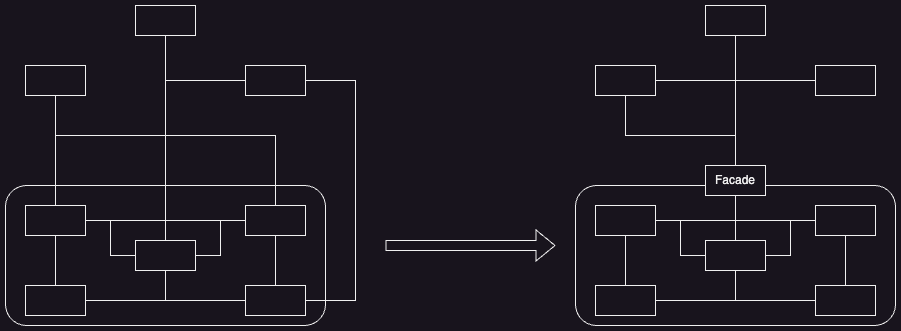
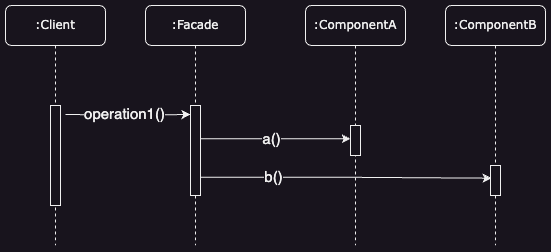
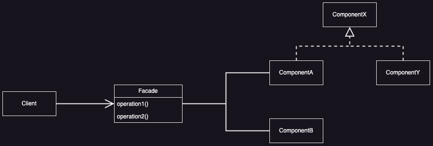

# Facade Pattern

## Intent

Provide a unified interface to a set of interfaces in a subsystem. Facade defines a higher-level interface that makes the subsystem easier to use.



## Problem

How to simplify the interface for a client that interacts with a web of components?

## Solution

Define a class in-between the client and the components. The class interacts with components and provides a simple interface with for the client.

## Applicability

* ***Simplify Complex Systems***
    * Provide a straightforward interface to a complex system, making it easier for most clients to use without needing to delve into details

* ***Reduce Dependencies***
    * Decouple clients from the intricate implementation details, enhancing subsystem independence and portability

* ***Organize Subsystems***
    * Establish a clear entry point for each subsystem level, simplifying interactions and dependencies between interconnected subsystems

## Benefits

* ***Simplifies Usage***
    * Shields clients from complex subsystem components, reducing the number of objects clients need to manage
    * Makes the subsystem easier to use by providing a simple interface

* **Promotes Weak Coupling**
    * Reduces strong coupling between subsystems and clients, allowing subsystem components to change without affecting clients
    * Helps organize layers and dependencies in the system, eliminating complex or circular dependencies
  
* ***Reduces Compilation Dependencies***
  * Minimizes recompilation needs when subsystems classes change, saving time in large software systems
  * Simplifies porting systems to other platforms, as changes in one subsystem are less likely to affect others

## Liabilities

* ***Does Not Restrict Access***
  * Allows applications to use subsystems classes directly if needed, offering flexibility between ease of use and detailed control

## UML

### Sequence Diagram



### Class Diagram



## Code Example

In this example, the Facade simplifies communication with a complex video conversion framework.

The Facade provides a single class with a single method that handles all the complexity of configuring the right classes of the framework and retrieving the result in a correct format.

*Example code used from [refactorguru](https://refactoring.guru)*.

```java
// Complex Subsystem

public class VideoFile {
    private final String name;
    private final String codecType;
    
    public VideoFile(String name) {
        this.name = name;
        this.codecType = name.substring(name.indexOf(".") + 1);
    }
    
    public String getCodecType() {
        return this.codecType;
    }
    
    public String getName() {
        return this.name;
    }
}

public interface Codec {}

public class MPEG4CompressionCodec implements Codec {
    public final String type = "mp4";
}

public class OggCompressionCodec implements Codec {
    public final String type = "ogg";
}

public class CodecFactory {
    public static Codec extract(VideoFile file) {
        String type = file.getCodecType();
        if (type.equals("mp4")) {
            System.out.println("CodecFactory: extracting mpeg audio...");
            return new MPEG4CompressionCodec();
        } else {
            System.out.println("CodecFactory: extracting ogg audio...");
            return new OggCompressionCodec();
        }
    }
}

public class BitRateReader {
    public static VideoFile read(VideoFile file, Codec codec) {
        System.out.println("BitRateReader: reading file...");
        return file;
    }
    
    public static VideoFile convert(VideoFile buffer, Codec codec) {
        System.out.println("BitRateReader: writing file...");
        return buffer;
    }
}

public class AudioMixer {
    public File fix(VideoFile result) {
        System.out.println("AudioMixer: fixing audio...");
        return new File("tmp");
    }
}
```

```java
// Facade
public class VideoConversionFacade {
  public File convertVideo(String fileName, String format) {
    System.out.println("VideoConversionFacade: conversion started.");
    VideoFile file = new VideoFile(fileName);
    Codec sourceCodec = CodecFactory.extract(file);
    Codec destinationCodec;

    if (format.equals("mp4"))
      destinationCodec = new MPEG4CompressionCodec();
    else
      destinationCodec = new OggCompressionCodec();

    VideoFile buffer = BitRateReader.read(file, sourceCodec);
    VideoFile intermediateResult = BitRateReader.convert(buffer, destinationCodec);
    File result = (new AudioMixer()).fix(intermediateResult);

    System.out.println("VideoConversionFacade: conversion completed.");

    return result;
  }
}
```

```java
public class Main {
    public static void main(String[] args) {
        VideoConversionFacade converter = new VideoConversionFacade();
        File mp4Video = converter.convertVideo("youtubevideo.ogg", "mp4");
    }
}
```
## Implementation Notes

### Reducing Client-Subsystem Coupling

To further reduce coupling between clients and subsystems, make the Facade an abstract class with concrete subclasses for different subsystem implementations. Clients interact with the subsystem through the abstract Facade interface, keeping them unaware of which specific implementation is used. Alternatively, you can configure a Facade object with various subsystem objects, allowing easy customization by replacing one or more of these objects.

```java
// Abstract Class Approach

abstract class SubsystemFacade {
    public abstract void operation();
}

class ConcreteSubsystemFacadeA extends SubsystemFacade { 
    private SubsystemA subsystemA = new SubsystemA();
    private SubsystemB subsystemB = new SubsystemB();

    @Override
    public void operation() {
        subsystemA.doSomething();
        subsystemB.doSomethingElse();
    }
}

class ConcreteSubsystemFacadeB extends SubsystemFacade {
    private SubsystemC subsystemC = new SubsystemC();
    
    @Override
    public void operation() {
        subsystemC.performAction();
    }
}
```

```java
// Configuration Approach

class ConfigurableSubsystemFacade {
    private SubsystemA subsystemA;
    private SubsystemB subsystemB;
    
    public ConfigurationSubsystemFacade(SubsystemA a, SubsystemB b) {
        this.subsystemA = a;
        this.subsystemB = b;
    }
    
    public void operation() {
        subsystemA.doSomething();
        subsystemB.doSomethingElse();
    }
}
```

### Public vs Private Subsystem Classes

A subsystem, like a class, has both public and private interfaces. The public interface consists of classes that all clients can access, while the private interface is for subsystem internals. The Facade class is part of the public interface, but other subsystem classes are usually public as well.

In modern languages, namespaces (like those in C++ or packages in Java) help manage the visibility of subsystem classes, allowing you to expose only the public parts of a subsystem. While making classes entirely private to a subsystem isn't always possible, proper use of namespaces and access modifiers can achieve similar encapsulation.

## Related Patterns

* **Abstract Factory**
    * Can be used with Facade to provide an interface for creating subsystem objects in a subsystem-independent way.
    * Can also be used as an alternative to Facade to hide platform-specific classes.

* **Mediator**
    * The Mediator pattern, like the Facade pattern, abstracts functionality of existing classes. However, Mediator centralizes communication between colleague objects, with colleagues communicating through the mediator instead of directly with each other. In contrast, a Facade abstracts the interface to make subsystem objects easier to use without adding new functionality, and subsystem classes remain unaware of it.
    * ***Facade simplifies the interface for the client while the mediator simplifies the interaction between the components the mediator mediates.***

* **Singleton**
    * Usually one Facade object is required.

* **Proxy**
    * In a sense, both Proxy and Decorator add functionality to existing objects. However, proxy adds the functionality permanently while with decorator the functionality can be added and removed at will.

* **Visitor**
    * Both Decorator and Visitor add functionality to existing classes. However, in the Visitor the added functionality is typed-dependent.