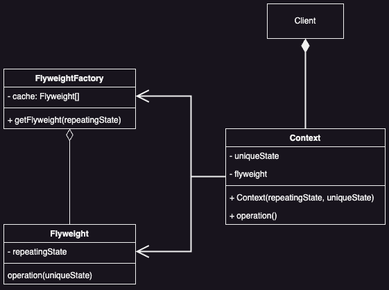

# Flyweight Pattern

## Introduction
Use sharing to support large numbers of fine-grained objects efficiently.

### Problem

How do we handle numerous instances of an object?

### Solution

The information stored in one object and referenced by all subsequent objects that wish to use it.

## Applicability

* ***High Object Count***
  * The application handles many objects.

* ***High Storage Costs***
  * Storing numerous objects is expensive.

* ***Extrinsic State***
  * Most object data can be stored externally.

* ***Object Sharing***
  * You can replace many objects with fewer shared ones by externalizing state.

* ***No Object Identity Dependence***
  * The application doesn't need unique identities for objects, allowing shared use.

## Understanding Flyweight Objects

A flyweight is a shared object used in multiple places at once, acting like an independent object in each context. It can't assume anything about its context. The key idea is separating intrinsic and extrinsic state. Intrinsic state is stored in the flyweight and is context-independent, making it sharable. Extrinsic state varies with the context and isn't shared. Clients must provide extrinsic state to the flyweight when needed. 

## Benefits

* **Space Savings**
  * ***Reduce Instances***: Fewer objects needed due to sharing.
  * ***Intrinsic State Efficiency***: Only shared, unchanging data is stored in each flyweight.
  * ***Extrinsic State Flexibility***: Extrinsic state can be computed *on-the-fly* instead of stored.

* ***Storage Optimization***
  * More shared flyweights mean greater space savings.
  * Savings are maximized when both intrinsic and extrinsic states are substantial and extrinsic state is computed.

## Liabilities

* **Runtime Costs**
  * ***Extrinsic State Management***: Transferring, finding, or computing extrinsic state at runtime can be costly.

* **Hierarchical Structures**
  * ***Composite Pattern Integration***: When used with the Composite pattern, flyweight nodes can't store parent pointers.
  * ***Communication Complexity***: Parent pointers must be passed as extrinsic state, complicating object communication in hierarchies.

## UML

### Class Diagram



## Code Example

### Scenario

In this example, we’re going to render a forest (1.000.000 trees)! Each tree will be represented by its own object that has some state (coordinates, texture and so on). Although the program does its primary job, naturally, it consumes a lot of RAM.

The reason is simple: too many tree objects contain duplicate data (name, texture, color). That’s why we can apply the Flyweight pattern and store these values inside separate flyweight objects (the TreeType class). Now, instead of storing the same data in thousands of Tree objects, we’re going to reference one of the flyweight objects with a particular set of values.

The client code isn’t going to notice anything since the complexity of reusing flyweight objects is buried inside a flyweight factory.

*Example code used from [refactorguru](https://refactoring.guru)*.

```java
// Client
public class Forest extends JFrame { 
    private final List<Tree> trees = new ArrayList<>();

    public void plantTree(int x, int y, String name, Color color, String otherTreeData) {
        TreeType type = TreeFactory.getTreeType(name, color, otherTreeData);
        Tree tree = new Tree(x, y, type);
        trees.add(tree);
    }

    @Override
    public void paint(Graphics graphics) {
        for (Tree tree : trees)
            tree.draw(graphics);
    }
}
```

```java
// Context
public class Tree {
    private int x;
    private int y;
    private TreeType type;

    public Tree(int x, int y, TreeType type) {
        this.x = x;
        this.y = y;
        this.type = type;
    }

    public void draw(Graphics g) {
        type.draw(g, x, y);
    }
}
```

```java
// Flyweight Factory
public class TreeFactory { 
    static Map<String, TreeType> treeTypes = new HashMap<>();
    
    public static TreeType getTreeType(String name, Color color, String otherTreeData) {
        return treeTypes.computeIfAbsent(name, n -> new TreeType(n, color, otherTreeData));
    }
}
```

```java
// Flyweight
public class TreeType {
    private final String name;
    private final Color color;
    private final String otherTreeData;

    public TreeType(String name, Color color, String otherTreeData) {
        this.name = name;
        this.color = color;
        this.otherTreeData = otherTreeData;
    }

    public void draw(Graphics g, int x, int y) {
        g.setColor(Color.BLACK);
        g.fillRect(x - 1, y, 3, 5);
        g.setColor(this.color);
        g.fillOval(x - 5, y - 10, 10, 10);
    }
}
```

## Implementation Notes

### Removing Extrinsic State

To effectively use the Flyweight pattern, focus on identifying and removing extrinsic state from shared objects. This is key to reducing storage costs. If there are as many types of extrinsic state as original objects, storage won't be optimized. The goal is to compute extrinsic state from a separate, smaller structure, minimizing overall storage needs.

## Related Patterns

* **Composite**
  * The Flyweight pattern is often combined with Composite pattern to implement a logically hierarchical structure in terms of a directed-acyclic graph with shared leaf nodes.

* **State and Strategy**
  * It's often best to implement State and Strategy objects as flyweights.
