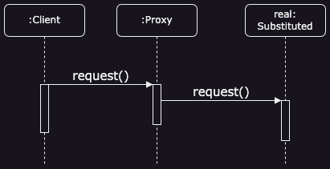
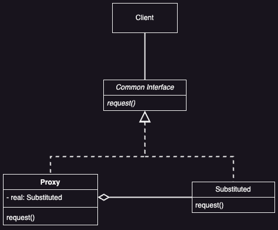

# Proxy Pattern

## Introduction

Provide a surrogate or placeholder for another object to control access.

### Problem

How does one provide a substitute for an object to control access?

### Solution

Define a `Proxy` class with the same interface as the substitute object. The proxy implements the control, and hides the substituted object. 

## Applicability

* ***Remote Proxy***
  * Represents an object in a different location.

* ***Virtual Proxy***
  * Creates costly objects only when needed.

* ***Protection Proxy***
  * Manages access to the original object, enforcing accesses rules.

* ***Smart Reference***
  * Enhances a pointer with extra actions on object access:
    * **Reference Counting**: Tracks object references to auto-release when unused.
    * **Lazy Loading**: Loads an object into memory on first use.
    * **Access Control**: Ensures the object is locked before access to prevent changes.

## Benefits

* ***Hides Complexity***
  * Remote proxies mask the object's different address space.

* ***Optimizes Resource Usage***
  * Virtual proxies create objects only when needed.
  * Copy-on-write postpones copying until modification.

* ***Manages Access and Maintenance***
  * Protection proxies enforces access rules.
  * Smart references handle extra tasks like reference counting and lazy loading.

*Copy-on-write* is an optimization technique that delays copying a large object until it's modified. Instead of duplicating the object immediately, a proxy tracks references and only creates a copy when a change is needed. This reduces the overhead of unnecessary copies, improving performance.

## Liabilities

* ***Performance Overhead***
  * Additional indirection can slow down access.

* ***Complexity***
  * Introduces complexity in code due to added layers of abstraction.

## UML

### Sequence Diagram



### Class Diagram



## Code Example

In this example, the Proxy pattern helps to implement the lazy initialization and caching to an inefficient 3rd-party YouTube integration library.

Proxy is invaluable when you have to add some additional behaviors to a class which code you can’t change.

```java
// 3rd party YouTube library code

public class Video {
    public String id;
    public String title;
    public String data;

    Video(String id, String title) {
        this.id = id;
        this.title = title;
        this.data = "Random Video";
    }
}

// Common Interface
public interface ThirdPartyYouTubeLib { 
    HashMap<String, Video> popularVideos();
    Video getVideo(String videoId);
}

// Substitute
public class ThirdPartyYouTubeClass implements ThirdPartyYouTubeLib {
    @Override
    public HashMap<String, Video> popularVideos() {
        connectToServer("http://www.youtube.com");
        return getRandomVideos();
    }

    @Override
    public Video getVideo(String videoId) {
        connectToServer("http://wwww.youtube.com/" + videoId);
        return getSomeVideo(videoId);
    }
  
    private int random() {
        return 5 + (int) (Math.random() * ((10 - 5) + 1));
    }
  
    private void experienceNetworkLatency() {
        int randomLatency = random();
        for (int i = 0; i < randomLatency; i++) {
            try {
                Thread.sleep(100);
            } catch (InterruptedException ex) {
                ex.printStackTrace();
            }
        }
    }
  
    private void connectToServer(String server) {
        System.out.println("Connecting to " + server + " ...");
        experienceNetworkLatency();
        System.out.println("Connected!");
    }
  
    private HashMap<String, Video> getRandomVideos() {
        System.out.println("Downloading populars...");
    
        experienceNetworkLatency();
        HashMap<String, Video> hmap = new HashMap<>();
        hmap.put("catzzzzzzzzz", new Video("sadgahasgdas", "Catzzzz.avi"));
        hmap.put("mkafksangasj", new Video("mkafksangasj", "Dog play with ball.mp4"));
        hmap.put("dancesvideoo", new Video("asdfas3ffasd", "Dancing video.mpq"));
        hmap.put("dlsdk5jfslaf", new Video("dlsdk5jfslaf", "Barcelona vs RealM.mov"));
        hmap.put("3sdfgsd1j333", new Video("3sdfgsd1j333", "Programing lesson#1.avi"));
    
        System.out.println("Done!");
        return hmap;
    }
  
    private Video getSomeVideo(String videoId) {
        System.out.println("Downloading video...");
        experienceNetworkLatency();
    
        Video video = new Video(videoId, "Some video title");
        System.out.println("Done!");
        return video;
    }
}
```

```java
// Proxy
public class YouTubeCacheProxy implements ThirdPartyYouTubeLib { 
    private ThirdPartyYouTubeLib youtubeService;
    private HashMap<String, Video> cachePopular = new HashMap<>();
    private final HashMap<String, Video> cacheAll = new HashMap<>();

    public YouTubeCacheProxy() {
        this.youtubeService = new ThirdPartyYouTubeClass();
    }

    @Override
    public HashMap<String, Video> popularVideos() {
        if (this.cachePopular.isEmpty())
            this.cachePopular = youtubeService.popularVideos();
        else
            System.out.println("Retrieved list from cache");
        return this.cachePopular;
    }

    @Override
    public Video getVideo(String videoId) {
        Video video = this.cacheAll.get(videoId);
        if (video == null) {
            video = youtubeService.getVideo(videoId);
            this.cacheAll.put(videoId, video);
        } else {
            System.out.println("Retrieved video '" + videoId + "' from cache");
        }
        return video;
    }

    public void reset() {
        cachePopular.clear();
        cacheAll.clear();
    }
}
```

```java
public class YouTubeDownloader {
    private ThirdPartyYouTubeLib api;

    public YouTubeDownloader(ThirdPartyYouTubeLib api) {
        this.api = api;
    }

    public void renderVideoPage(String videoId) {
        Video video = api.getVideo(videoId);
        System.out.println("\n-------------------------------");
        System.out.println("Video page (imagine fancy HTML)");
        System.out.println("ID: " + video.id);
        System.out.println("Title: " + video.title);
        System.out.println("Video: " + video.data);
        System.out.println("-------------------------------\n");
    }

    public void renderPopularVideos() {
        HashMap<String, Video> list = api.popularVideos();
        System.out.println("\n-------------------------------");
        System.out.println("Most popular videos on YouTube (imagine fancy HTML)");
        for (Video video : list.values()) {
            System.out.println("ID: " + video.id + " / Title: " + video.title);
        }
        System.out.println("-------------------------------\n");
    }
}
```

```java
public class Main {
    public static void main(String[] args) {
        YouTubeDownloader naiveDownloader = new YouTubeDownloader(new ThirdPartyYouTubeClass());
        YouTubeDownloader smartDownloader = new YouTubeDownloader(new YouTubeCacheProxy());

        long naive = test(naiveDownloader);
        long smart = test(smartDownloader);
        System.out.print("Time saved by caching proxy: " + (naive - smart) + "ms");

    }

    private static long test(YouTubeDownloader downloader) {
        long startTime = System.currentTimeMillis();

        // User behavior in our app:
        downloader.renderPopularVideos();
        downloader.renderVideoPage("catzzzzzzzzz");
        downloader.renderPopularVideos();
        downloader.renderVideoPage("dancesvideoo");
        // Users might visit the same page quite often.
        downloader.renderVideoPage("catzzzzzzzzz");
        downloader.renderVideoPage("someothervid");

        long estimatedTime = System.currentTimeMillis() - startTime;
        System.out.print("Time elapsed: " + estimatedTime + "ms\n");
        return estimatedTime;
    }
}
```

## Implementation Notes

### Proxy Doesn't Always Need to Know

A proxy doesn't need to know the exact type of its real subject if it interacts through an abstract interface. This allows one proxy class to handle all real subjects uniformly. However, if proxies need to instantiate real subjects (like a virtual proxy), they must know the specific class.

## Related Patterns

* **Adapter**
  * An adapter provides different interface to the object it adapts.
  * In contrast, a proxy provides the same interface as its subject.
  * ***A protection proxy might refuse operations that the subject allows, making its interface a subset of the subject's.***

* **Decorator**
  * A decorator adds one or more responsibilities to an object whereas a proxy controls access to an object.
  * Proxies vary in implementation. A protection proxy can be like a decorator. A remote proxy holds an indirect reference, like a host ID. A virtual proxy starts with an indirect reference, like a file name, and later uses a direct reference.